[Slovenščina](README_SL.md)

# BelPro — Beleženje Prostovoljstva

[](https://www.python.org/)
[](#)
[](https://docs.docker.com/compose/)
[](https://nginx.org/)
[](https://www.postgresql.org/)
[](https://redis.io/)
[](https://n8n.io/)
[](#)
[](https://github.com/EvolutionAPI/evolution-api)
[](./LICENSE)

Self-hosted system for Slovenian NGOs that automates the *Dnevnik prostovoljskega dela* (Volunteer Work Diary) required by Slovenian law for volunteers receiving the Work Activity Allowance (*Dodatek za delovno aktivnost*).

Volunteers log work via **WhatsApp** (voice notes, photos, or text). A manager reviews and approves entries via WhatsApp and a web dashboard. Monthly PDF reports are generated automatically for submission to the local CSD (Centre for Social Work).

---

## How it works

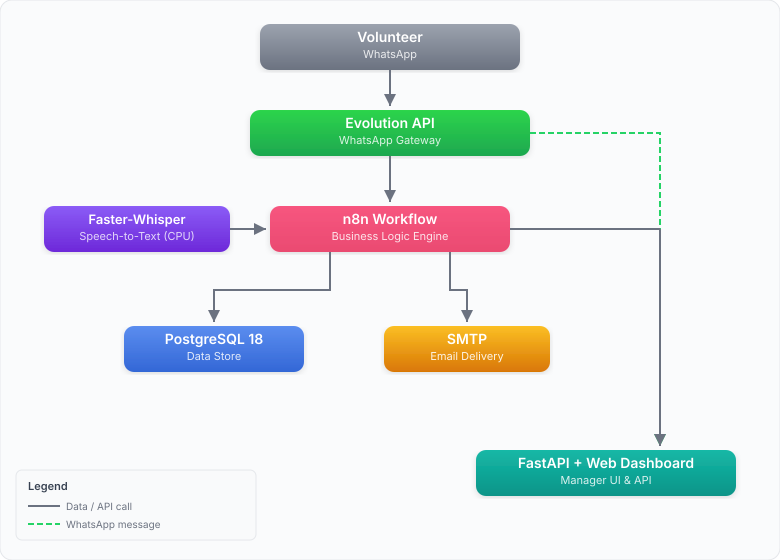

1. Volunteer sends a voice note, photo, or text message to the NGO's WhatsApp number.
2. n8n transcribes audio via Faster-Whisper (local, CPU, Slovenian), extracts date/hours/location/activity, and sends the volunteer a confirmation summary with Potrdi / Popravi / Prekliči buttons.
3. On confirmation, the entry moves to `pending_manager` and the manager gets a WhatsApp notification with Approve / Reject buttons.
4. On the 28th of each month, PDFs are generated automatically and emailed — one per volunteer (for CSD submission) and a consolidated one to the manager.

---

## Manager dashboard

The web dashboard (`http://localhost:80`) is the manager's control centre for the full volunteer lifecycle.

<table>
<tr>
<td><b>Volunteers</b> — Register, edit, activate/deactivate volunteers; per-volunteer history view; per-volunteer report channel toggles (WhatsApp / email)</td>
<td align="center"><a href="docs/images/belpro-prostovoljci.png">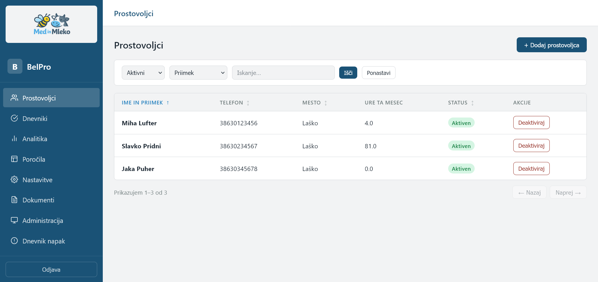</a></td>
</tr>
<tr>
<td><b>Volunteer detail</b> — Per-volunteer page with contact info, report channel preferences, and personal work diary.</td>
<td align="center"><a href="docs/images/belpro-prostovoljec.png">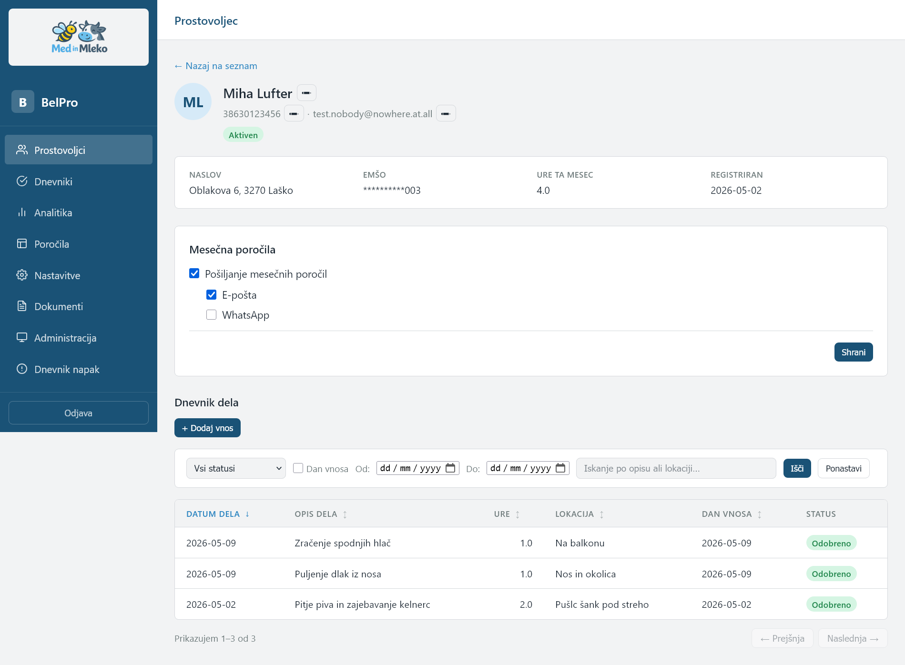</a></td>
</tr>
<tr>
<td><b>Pending approvals</b> — One-click approve or reject for entries awaiting manager review; photo thumbnails shown inline; add or remove photos directly from the approval view<br><br><b>Log & history</b> — Full searchable entry log across all periods; filter by volunteer, month, status, or location; CSV export</td>
<td align="center"><a href="docs/images/belpro-dnevniki.png">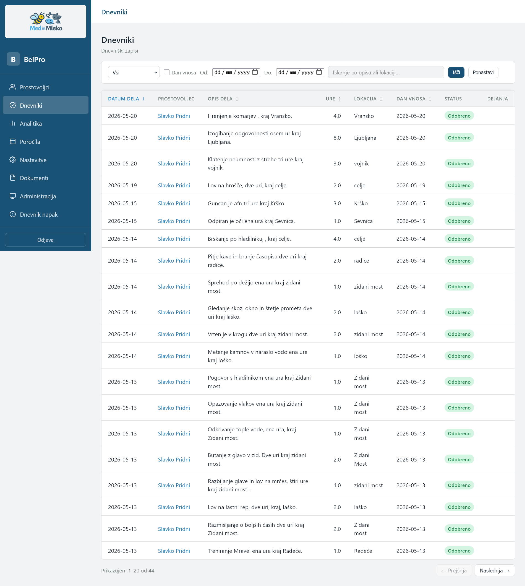</a></td>
</tr>
<tr>
<td><b>Entry detail</b> — Full entry view with work description, voice transcript, location, and attached photos.</td>
<td align="center"><a href="docs/images/belpro-vnos-pregled-urejanje.png">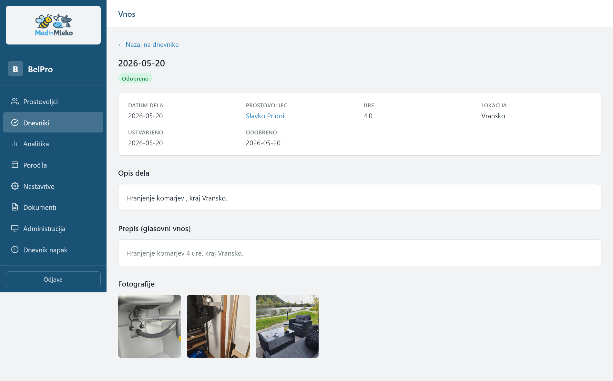</a></td>
</tr>
<tr>
<td><b>Analytics</b> — KPI tiles (hours, active volunteers, entry counts); hours-per-volunteer and hours-per-location charts; 6-month trend; year/month navigator; CSV export; print-friendly layout</td>
<td align="center"><a href="docs/images/belpro-analitika.png">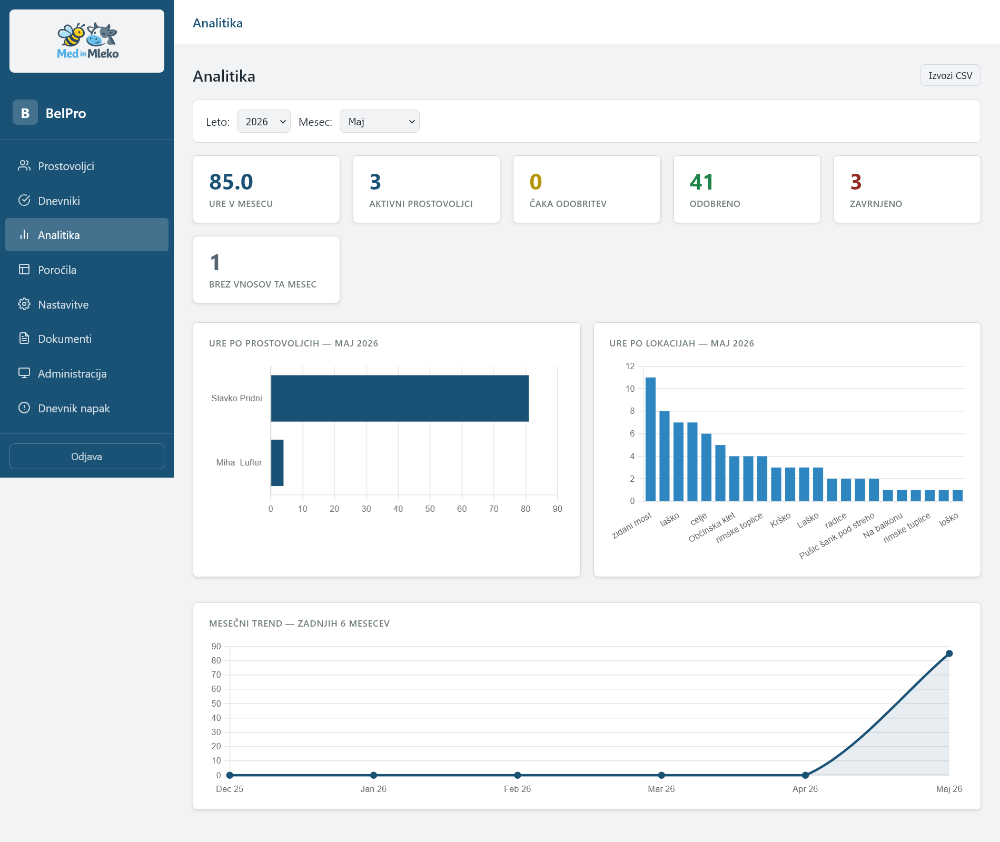</a></td>
</tr>
<tr>
<td><b>Reports</b> — Generate and download monthly PDFs on demand (per volunteer or consolidated); send reports by email or WhatsApp on demand or let the automated cron handle delivery on a configurable day (default: 28th) covering either the current or previous month; Arhiv poročil section for browsing and downloading all previously generated reports</td>
<td align="center"><a href="docs/images/belpro-porocila.png">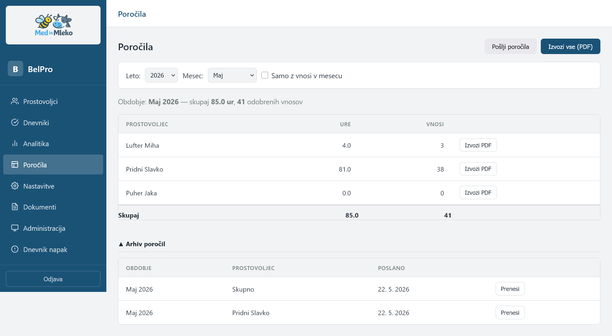</a></td>
</tr>
<tr>
<td><b>Settings</b> — Manager profile, password, SMTP configuration, WhatsApp bot phone display, report delivery defaults for new volunteers</td>
<td align="center"><a href="docs/images/belpro-nastavitve.png">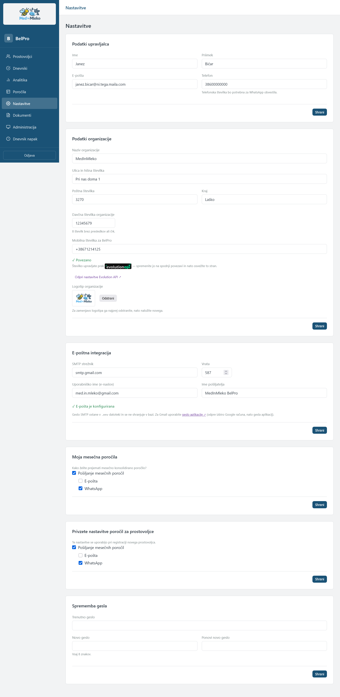</a></td>
</tr>
<tr>
<td><b>GDPR compliance</b> — Generate and download the volunteer consent agreement (<em>Dogovor o prostovoljstvu</em>) as a ready-to-print PDF, with optional additional clauses</td>
<td align="center"><a href="docs/images/belpro-dokumenti.png">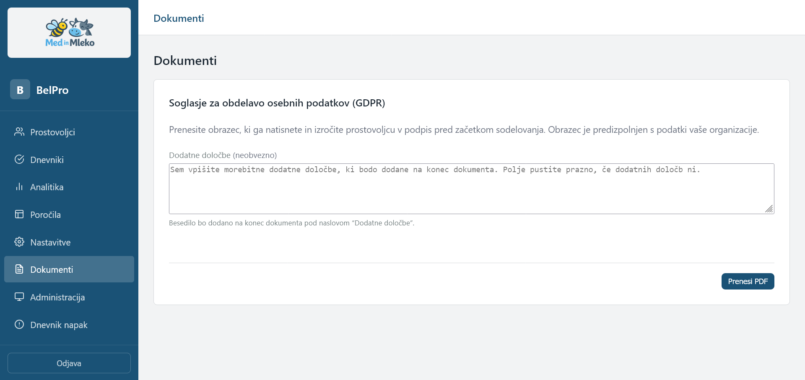</a></td>
</tr>
<tr>
<td><b>System administration</b> — Runtime-tunable settings without a container restart: photo limit per entry, photo retention period, session duration, auto-report delivery day and period, backup hour, photo-cleanup hour, backup retention period; live health widget showing all service states (PostgreSQL, Whisper, n8n, WhatsApp, disk, last entry heartbeat) refreshed every 30 s</td>
<td align="center"><a href="docs/images/belpro-administracija.png">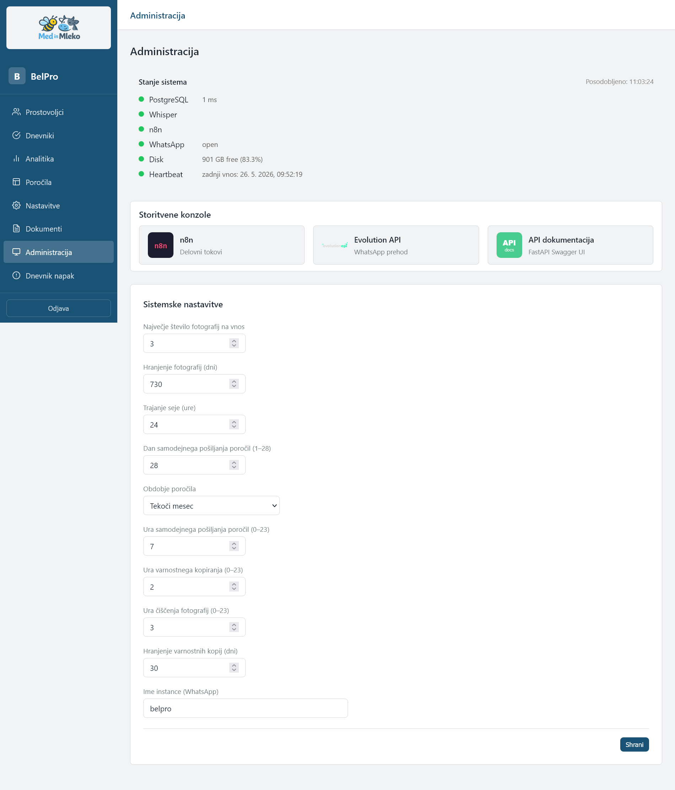</a></td>
</tr>
<tr>
<td><b>Error log (Dnevnik napak)</b> — Operational errors from background jobs (nightly backup, photo cleanup) shown with per-error acknowledge; nav badge tracks unacknowledged count</td>
<td align="center"><a href="docs/images/belpro-dnevnik-napak.png">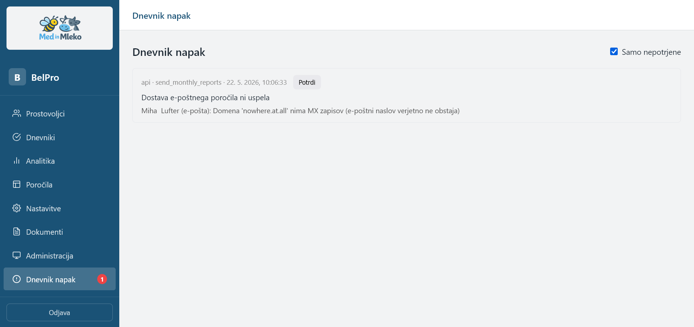</a></td>
</tr>
</table>

### Sample PDF reports

- [Monthly report — example (May 2026)](docs/images/porocilo_2026_05-primer.pdf) — consolidated monthly report sent to the manager
- [Per-volunteer report — example (Pridni Slavko, May 2026)](docs/images/porocilo_Pridni_Slavko_2026_05-primer.pdf) — individual report submitted to CSD

---

## Stack

| Service | Technology | Port |
|---------|-----------|------|
| Database | PostgreSQL 18 | internal |
| Workflow engine | n8n | 5678 |
| Speech-to-text | Faster-Whisper (CPU) | internal |
| Backend API | FastAPI | 8100 |
| Manager dashboard | nginx + HTML/JS/CSS | 80 |
| WhatsApp gateway | Evolution API | 8180 |
| Cache/queue | Redis 7 | internal |
| Ops sidecar | Alpine/Python | internal |

---

## Requirements

- Docker and Docker Compose (v2)
- 2 CPU cores, 4 GB RAM minimum (Whisper `medium` model)
- 8 GB RAM recommended for `large-v3` Whisper model
- A dedicated WhatsApp phone number (prepaid SIM is fine — never use a personal number)
- An SMTP email account for outgoing email (e.g., Gmail with an App Password)

**Local development:** Windows 10 with WSL2 + Docker Desktop. All commands below run inside WSL2 (Ubuntu).

---

## Installation

### Quick start — setup wizard

The fastest way to get BelPro running is the interactive setup wizard. It handles `.env` creation, secret generation, service startup, and DB migrations in one go.

```bash
git clone https://github.com/AndrejMX13/belpro.git
cd belpro
bash scripts/setup.sh
```

The wizard will:

1. Verify Docker and Docker Compose are available.
2. Create `.env` from `.env.example` (or keep an existing one).
3. Prompt for passwords: PostgreSQL, manager dashboard, n8n, and SMTP (optional — can be skipped and added later).
4. Auto-generate all cryptographic secrets (`EMSO_ENCRYPTION_KEY`, `API_SECRET_KEY`, `EVOLUTION_API_KEY`).
5. Start all Docker services (`docker compose up -d --build`).
6. Wait for PostgreSQL and the API to become healthy.
7. Run Alembic database migrations automatically.
8. Print a checklist of the remaining manual steps (n8n workflow import, WhatsApp setup).

> **Note:** The wizard prints instructions in Slovenian — this is intentional, as the primary users of BelPro are Slovenian NGOs.

After the wizard completes, continue from [WhatsApp setup](#whatsapp-setup) below.

---

### Manual installation (alternative)

Use this if you prefer step-by-step control or are re-deploying on an existing environment.

### 1. Clone the repository

```bash
git clone https://github.com/AndrejMX13/belpro.git
cd belpro
```

### 2. Create and configure the environment file

```bash
cp .env.example .env
```

Edit `.env` and fill in every value. Key ones to generate:

```bash
# EMSO encryption key (32 bytes, base64url)
python -c "import secrets, base64; print(base64.urlsafe_b64encode(secrets.token_bytes(32)).decode())"

# API secret key
python -c "import secrets; print(secrets.token_hex(32))"

# Evolution API key
python -c "import secrets; print(secrets.token_hex(24))"
```

Minimum required values in `.env`:

| Variable | Description |
|----------|-------------|
| `POSTGRES_PASSWORD` | Strong password for PostgreSQL |
| `DATABASE_URL` | Must match `POSTGRES_USER` / `POSTGRES_PASSWORD` |
| `EMSO_ENCRYPTION_KEY` | Generated above — keep safe, losing it makes EMŠO unreadable |
| `API_SECRET_KEY` | Generated above |
| `MANAGER_PASSWORD` | Initial dashboard login password |
| `N8N_BASIC_AUTH_USER` | n8n UI login username |
| `N8N_BASIC_AUTH_PASSWORD` | n8n UI login password |
| `N8N_WEBHOOK_URL` | `http://localhost:5678/` for local; public URL if remote |
| `AUTHENTICATION_API_KEY` | Generated by you — global key that secures the Evolution API server (used to log into `:8180/manager/`) |
| `EVOLUTION_API_KEY` | Instance-level key — copy from the instance detail page after creating the `belpro` instance in Evolution API |
| `SMTP_PASSWORD` | SMTP password (no spaces). For Gmail: create an [App Password](https://myaccount.google.com/apppasswords) |

### 3. Start all services

```bash
docker compose up -d
```

First startup takes several minutes — Faster-Whisper downloads the model (~1.5 GB for `medium`).

Check that all services are healthy:

```bash
docker compose ps
```

All services should show `running` or `healthy`. If `whisper` takes longer, that is normal during the first model download.

### 4. Run database migrations

```bash
docker compose exec api alembic upgrade head
```

### 5. Log in to the dashboard

Open **http://localhost:80** in a browser.

- Username: `admin` (fixed)
- Password: the value of `MANAGER_PASSWORD` from your `.env`

After logging in, go to **Settings** to set the manager name, phone number, NGO name, and address. These appear on generated PDFs.

---

## WhatsApp setup

### 6. Create the Evolution API instance

Open the Evolution API manager at **http://localhost:8180/manager/**.

1. Log in with your `AUTHENTICATION_API_KEY`.
2. Create an instance named `belpro` (must match `EVOLUTION_INSTANCE_NAME` in `.env`).

Do not scan the QR code yet — set up n8n first so workflows are active before WhatsApp goes live.

### 7. Configure n8n workflows

Open n8n at **http://localhost:5678** and log in with `N8N_BASIC_AUTH_USER` / `N8N_BASIC_AUTH_PASSWORD`.

1. Generate an n8n API key under **Settings → API** and add it to `.env` as `N8N_API_KEY`.
2. Import the workflow files from `n8n/workflows/`:
   ```bash
   ./scripts/n8n_workflows.py import
   ```
3. Set up credentials as documented in `n8n/credentials/README.md`.
4. Activate all workflows.

### 8. Connect WhatsApp

Back in the Evolution API manager at **http://localhost:8180/manager/**, open the `belpro` instance and scan the QR code with the dedicated WhatsApp phone.

The instance status should change to `open` (connected). The phone must stay connected for the bot to receive messages.

> **Known issue:** The dashboard QR modal does not render the QR image, and `CONFIG_SESSION_PHONE_VERSION` must be set in `docker-compose.yml` or WhatsApp will reject the connection entirely. If the QR does not appear or the instance never connects, see **[EVOLUTION_QR_TROUBLESHOOTING.md](EVOLUTION_QR_TROUBLESHOOTING.md)** for the full diagnosis and all required commands.

### Workflow management

The three n8n workflows (`volunteer_entry`, `manager_approval`, `monthly_reports`) are stored as JSON in `n8n/workflows/` and loaded with `scripts/n8n_workflows.py`.

**Prerequisites:** Generate an API key in n8n UI → Settings → API and add it to `.env`:
```
N8N_API_KEY=<your-key>
```
`N8N_WEBHOOK_URL` defaults to `http://localhost:5678` — override in `.env` if your instance runs elsewhere.

**Load workflows into n8n** (fresh install or after pulling updates from git):
```bash
./scripts/n8n_workflows.py import
```

**Export workflows from n8n to the repository** (after editing in the n8n UI):
```bash
./scripts/n8n_workflows.py export
git add n8n/workflows/
git commit -m "chore: update n8n workflow exports"
```

---

## Access points

| URL | What |
|-----|------|
| http://localhost:80 | Manager dashboard |
| http://localhost:8100/docs | FastAPI Swagger UI |
| http://localhost:5678 | n8n workflow editor |
| http://localhost:8180/manager/ | Evolution API (WhatsApp gateway) |

---

## Maintenance

### Upgrade

```bash
bash scripts/upgrade.sh
```

Automatically: takes a backup, pulls the latest code (`git pull`), rebuilds Docker images, waits for PostgreSQL and API readiness, runs Alembic migrations, and prints a health check summary. Safe to run repeatedly.

### Backup

```bash
bash scripts/backup.sh
```

Backs up the PostgreSQL database and stored photos/PDFs.

Backups also run **automatically every night** (default: 02:00, configurable from the System administration page) via the `ops` sidecar container — no host-level cron configuration needed. Backup failures are reported to the Dnevnik napak error log visible in the dashboard. Retention is configurable from the System administration page (default: 30 days); the `BACKUP_RETENTION_DAYS` env var is still accepted as a fallback.

### Restore

```bash
bash scripts/restore.sh <backup-file>
```

### Tail logs

```bash
docker compose logs -f
docker compose logs -f api
docker compose logs -f n8n
```

### Rebuild a service after code changes

```bash
docker compose up -d --build api
docker compose up -d --build whisper
```

### Reset a forgotten dashboard password

If you changed the password via the dashboard Settings page and forgot it:

```bash
docker compose exec postgres psql -U belpro -d belpro \
  -c "UPDATE managers SET password_hash = NULL;"
```

This clears the stored hash and falls back to `MANAGER_PASSWORD` in `.env` on next login.

### EMŠO Key Rotation

**Emergency tool — use only when the encryption key must be replaced.**

```bash
bash scripts/rotate_emso_key.sh <OLD_KEY> <NEW_KEY>
```

`OLD_KEY` is the current `EMSO_ENCRYPTION_KEY` from `.env`. Generate a new key with:

```bash
python3 -c "import secrets,base64; print(base64.urlsafe_b64encode(secrets.token_bytes(32)).decode())"
```

The script takes a full backup, creates a targeted backup of the volunteers table (including the old key) in `/app/pdfs/temp/`, re-encrypts all EMŠOs in a single atomic transaction, verifies a sample, then guides you through updating `.env` and restarting the api container. Once you confirm everything is green it offers to delete the sensitive backup file.

To restore if something goes wrong after rotation:

```bash
bash scripts/rotate_emso_key.sh --restore
```

> See [docs/emso_key_rotation.md](docs/emso_key_rotation.md) for the full procedure guide, including known issues encountered during the first live test.

### Applying `.env` changes

Editing `.env` does **not** take effect automatically. The affected container must be **recreated** — not just restarted — so Docker picks up the new environment:

```bash
docker compose up -d <service>
```

`docker compose restart <service>` is not sufficient: it restarts the existing container without re-reading `.env`.

---

## Security notes

- **EMŠO** (national ID number) is encrypted at rest using AES-256. Never log it, never expose it in API responses to the frontend.
- Photos are stored locally — never in cloud storage.
- The `EMSO_ENCRYPTION_KEY` must be backed up separately. Losing it makes all stored EMŠO values unreadable.
- Use a dedicated email account for outgoing mail (e.g., a purpose-made Gmail with an App Password), not a personal account.
- Never use a personal WhatsApp number — Evolution API takes over the session.
- `.env` is gitignored and must never be committed.

---

## Project layout

```
belpro/
├── docker-compose.yml
├── .env.example
├── n8n/workflows/          # n8n workflow JSON exports (committed)
├── whisper/                # Faster-Whisper HTTP wrapper
├── api/                    # FastAPI backend + PDF generation
│   └── tests/              # pytest suite (240 tests, 84% coverage)
├── frontend/               # Manager dashboard (HTML/CSS/JS)
├── ops/                    # Ops sidecar: automated backup, photo cleanup, error reporting
├── nginx/                  # Reverse proxy config
├── scripts/                # setup.sh, upgrade.sh, backup.sh, restore.sh, rotate_emso_key.sh
└── db/                     # init.sql + Alembic migrations
```

Full system specification: [SPEC.md](SPEC.md)

---

## AI-assisted development

This project was developed with the help of the following tools, whose configuration and output files are committed to the repository:

- **[Claude Code](https://code.claude.com/docs/en/quickstart)** — Anthropic's AI coding assistant, used for implementation, workflow automation, and debugging throughout the project.
- **[Serena](https://github.com/oraios/serena)** — MCP server for semantic code navigation (symbol search, cross-referencing). Configuration and project memory files live in `.serena/`.
- **[Graphify](https://github.com/safishamsi/graphify)** — AST-based knowledge graph generator for codebase mapping. Output lives in `graphify-out/`.
- **[Superpowers](https://github.com/obra/superpowers)** — Claude Code plugin providing structured development workflows (brainstorming, planning, subagent-driven execution, code review). Configuration lives in `.claude/`.
- **[n8n-mcp](https://github.com/czlonkowski/n8n-mcp)** — MCP server for managing n8n workflows directly from Claude Code. Used throughout to create, update, and validate workflows without touching JSON by hand.

---

## Roadmap

See [ROADMAP.md](ROADMAP.md) for what's planned before v1.0 and what has already shipped.

---

## Out of scope (v1)

- Multi-tenant / SaaS mode
- Multiple managers per NGO
- Non-Slovenian language support
- Mobile native app
- Integration with IRSD / government systems
