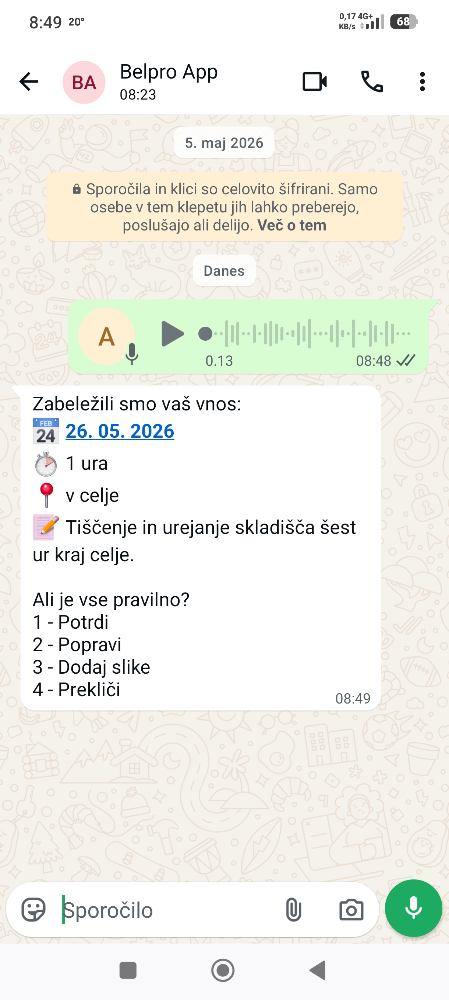
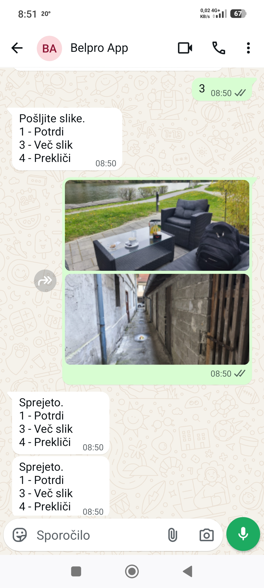
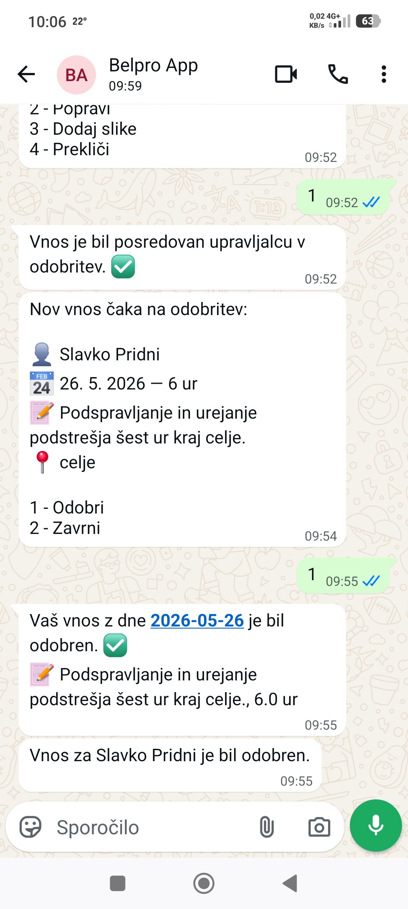
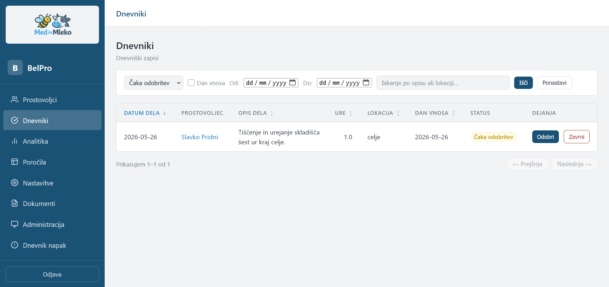

[English](README.md)

# BelPro — Beleženje Prostovoljstva

[](https://www.python.org/)
[](#)
[](https://docs.docker.com/compose/)
[](https://nginx.org/)
[](https://www.postgresql.org/)
[](https://redis.io/)
[](https://n8n.io/)
[](#)
[](https://github.com/EvolutionAPI/evolution-api)
[](./LICENSE)

Sistem, ki deluje na vašem strežniku in slovenskim nevladnim organizacijam avtomatizira vodenje Dnevnika prostovoljskega dela, ki ga zakonodaja zahteva za prostovoljce, ki prejemajo dodatek za delovno aktivnost.

Prostovoljci beležijo delo prek **WhatsApp** (glasovni zapiski, fotografije ali besedilo). Vodja pregleda in odobri vnose prek WhatsAppa in spletne nadzorne plošče. Mesečna poročila v PDF obliki se samodejno ustvarijo za predložitev lokalnemu CSD (Centru za Socialno Delo).

---

## Kako deluje

<table>
<tr>
<td><b>Glasovni zapis ali besedilni vnos</b> — Prostovoljec pošlje glasovno sporočilo ali besedilno sporočilo na WhatsApp številko NVO. BelPro pretvori zvok v besedilo s Faster-Whisper (lokalno, na procesorju, v slovenščini), izlušči datum, ure, lokacijo in aktivnost ter pošlje povzetek z možnostmi: 1&nbsp;Potrdi / 2&nbsp;Popravi / 3&nbsp;Dodaj slike / 4&nbsp;Prekliči.</td>
<td align="center"><a href="docs/images/Belpro-WhatsApp-1.jpg"></a></td>
</tr>
<tr>
<td><b>Dodajanje fotografij</b> — Izbira <em>Dodaj slike</em> odpre fotografski podmeni. Prostovoljec pošlje eno ali več fotografij; bot vsako posebej potrdi in ponudi možnosti Potrdi / Več slik / Prekliči.</td>
<td align="center"><a href="docs/images/Belpro-WhatsApp-2.jpg"></a></td>
</tr>
<tr>
<td><b>Odobritev vodje in mesečna poročila</b> — Po potrditvi se vnos premakne v stanje <em>pending_manager</em>, vodja pa prejme WhatsApp obvestilo z možnostma Odobri / Zavrni. Obe strani prejmeta obvestilo o odločitvi. Na nastavljiv dan v mesecu (privzeto 28.) se samodejno ustvarijo PDF poročila in dostavijo — <a href="docs/images/porocilo_Pridni_Slavko_2026_05-primer.pdf">poročilo prostovoljca (primer)</a> · <a href="docs/images/porocilo_2026_05-primer.pdf">zbirno poročilo (primer)</a>.</td>
<td align="center"><a href="docs/images/Belpro-WhatsApp-3.jpg"></a></td>
</tr>
</table>

---

## Nadzorna plošča za vodje

Spletna nadzorna plošča (`http://localhost:80`) je vodji centralno orodje za upravljanje celotnega življenjskega cikla prostovoljcev.

<table>
<tr>
<td><b>Prostovoljci</b> — Registracija, urejanje, aktivacija/deaktivacija prostovoljcev; pregled zgodovine posameznega prostovoljca; preklopniki za kanal poročil (WhatsApp / e-pošta)</td>
<td align="center"><a href="docs/images/belpro-prostovoljci.png"></a></td>
</tr>
<tr>
<td><b>Prostovoljec (podrobnosti)</b> — Stran posameznega prostovoljca s kontaktnimi podatki, nastavitvami kanala poročil in osebnim dnevnikom dela.</td>
<td align="center"><a href="docs/images/belpro-prostovoljec.png"></a></td>
</tr>
<tr>
<td><b>Čakajoče odobritve</b> — Odobritev ali zavrnitev vnosov z enim klikom; sličice fotografij prikazane neposredno v seznamu; dodajanje in odstranjevanje fotografij iz pogleda za odobritev</td>
<td align="center"><a href="docs/images/BelPro-Dnevniki-Pending-Manager.png"></a></td>
</tr>
<tr>
<td><b>Dnevnik in zgodovina</b> — Celoten seznam vnosov z možnostjo iskanja za vsa obdobja; filtriranje po prostovoljcu, mesecu, statusu ali lokaciji; izvoz v CSV</td>
<td align="center"><a href="docs/images/belpro-dnevniki.png"></a></td>
</tr>
<tr>
<td><b>Vnos (podrobnosti)</b> — Podroben pogled na vnos z opisom dela, prepisom glasovnega sporočila, lokacijo in priloženimi fotografijami.</td>
<td align="center"><a href="docs/images/belpro-vnos-pregled-urejanje.png"></a></td>
</tr>
<tr>
<td><b>Analitika</b> — KPI ploščice (ure, aktivni prostovoljci, število vnosov); grafikoni ur po prostovoljcu in po lokaciji; trend za 6 mesecev; izbirnik leta/meseca; izvoz v CSV; tiskalniku prijazna postavitev</td>
<td align="center"><a href="docs/images/belpro-analitika.png"></a></td>
</tr>
<tr>
<td><b>Poročila</b> — Ustvarjanje in prenos mesečnih PDF-jev na zahtevo (po prostovoljcu ali zbirno); pošiljanje poročil po e-pošti ali WhatsAppu na zahtevo ali samodejno prek cron opravila na nastavljiv dan (privzeto 28.) za tekoči ali prejšnji mesec; razdelek Arhiv poročil za pregled in prenos vseh predhodno ustvarjenih poročil</td>
<td align="center"><a href="docs/images/belpro-porocila.png"></a></td>
</tr>
<tr>
<td><b>Nastavitve</b> — Profil vodje, geslo, nastavitev SMTP, prikaz telefonske številke WhatsApp bota, privzeti kanal dostave poročil za nove prostovoljce</td>
<td align="center"><a href="docs/images/belpro-nastavitve.png"></a></td>
</tr>
<tr>
<td><b>Skladnost z GDPR</b> — Ustvarjanje in prenos dogovora o prostovoljstvu (<em>Dogovor o prostovoljstvu</em>) kot PDF pripravljen za tisk, z možnostjo dodatnih klavzul</td>
<td align="center"><a href="docs/images/belpro-dokumenti.png"></a></td>
</tr>
<tr>
<td><b>Administracija</b> — Nastavitve, nastavljive med delovanjem brez ponovnega zagona vsebnika: omejitev fotografij na vnos, obdobje hrambe fotografij, trajanje seje, dan in obdobje samodejne dostave poročil, ura varnostnega kopiranja, ura čiščenja fotografij, obdobje hrambe varnostnih kopij; živi pripomoček za stanje sistema z vsemi storitvami (PostgreSQL, Whisper, n8n, WhatsApp, disk, zadnji vnos) z osvežitvijo vsakih 30 s</td>
<td align="center"><a href="docs/images/belpro-administracija.png"></a></td>
</tr>
<tr>
<td><b>Dnevnik napak</b> — Operacijske napake opravil v ozadju (nočno varnostno kopiranje, čiščenje fotografij) z možnostjo potrditve vsake napake; oznaka v navigacijski vrstici prikazuje število nepotrjenih</td>
<td align="center"><a href="docs/images/belpro-dnevnik-napak.png"></a></td>
</tr>
</table>

---

## Tehnološki sklad (Stack)

<a href="docs/images/belpro-arhitektura-komponente.svg"></a>

| Storitev | Tehnologija | Vrata (Port) |
|---------|-----------|------|
| Zbirka podatkov | PostgreSQL 18 | interno |
| Avtomatizacija procesov | n8n | 5678 |
| Pretvorba govora v besedilo | Faster-Whisper (CPU) | interno |
| Ozadje (Backend API) | FastAPI | 8100 |
| Nadzorna plošča za vodje | nginx + HTML/JS/CSS | 80 |
| WhatsApp vmesnik (Gateway) | Evolution API | 8180 |
| Predpomnilnik / vrsta | Redis 7 | interno |
| Operacijski spremljevalnik | Alpine/Python | interno |

Celotna sistemska specifikacija: [SPEC.md](SPEC.md)

---

## Sistemske zahteve

- Docker in Docker Compose (v2)
- Najmanj 2 jedri procesorja (CPU) in 4 GB delovnega pomnilnika (RAM) (Whisper `medium` model)
- Priporočljivo 8 GB RAM-a za `large-v3` Whisper model
- Namenska WhatsApp telefonska številka (predplačniška SIM kartica je povsem v redu — nikoli ne uporabljajte osebne številke)
- SMTP e-poštni račun za pošiljanje e-pošte (npr. Gmail z geslom za aplikacije)

**Lokalni razvoj:** Windows 10 with WSL2 + Docker Desktop. Vsi spodnji ukazi se izvajajo znotraj WSL2 (Ubuntu).

---

## Namestitev

### Hitri začetek — čarovnik za namestitev

Najhitrejši način za zagon projekta BelPro je uporaba interaktivnega čarovnika za namestitev. Ta v enem koraku poskrbi za ustvarjanje datoteke `.env`, generiranje skrivnih ključev, zagon storitev in migracijo zbirke podatkov.

```bash
git clone https://github.com/AndrejMX13/belpro.git
cd belpro
bash scripts/setup.sh
```

Čarovnik bo:

1. Preveril, ali sta na voljo Docker in Docker Compose.
2. Ustvaril datoteko `.env` iz predloge `.env.example` (ali ohranil obstoječo).
3. Pozval k vnosu gesel: za PostgreSQL, nadzorno ploščo, n8n in SMTP (izbirno — lahko preskočiš in dodaš kasneje).
4. Samodejno generiral vse kriptografske ključe (`EMSO_ENCRYPTION_KEY`, `API_SECRET_KEY`, `EVOLUTION_API_KEY`).
5. Zagnal vse Docker storitve (`docker compose up -d --build`).
6. Počakal, da PostgreSQL in API postaneta aktivna in dostopna.
7. Samodejno izvedel Alembic migracije zbirke podatkov.
8. Izpisal seznam preostalih ročnih korakov (uvoz n8n procesov, nastavitev WhatsAppa).


Po zaključku čarovnika nadaljuj s korakom [Nastavite WhatsAppa](#nastavite-whatsappa) spodaj.

---

### Ročna namestitev (alternativno)

To možnost uporabi, če želiš imeti popoln nadzor nad vsakim korakom ali če sistem ponovno nameščaš v obstoječem okolju.

### 1. Kloniranje repozitorija

```bash
git clone https://github.com/AndrejMX13/belpro.git
cd belpro
```

### 2. Ustvarjanje in nastavljanje okoljske datoteke (.env)

```bash
cp .env.example .env
```

> Vsi komentarji v `.env.example` so v angleščini. Če ti je lažje, je na voljo tudi slovensko prevedena različica: `.env.example.sl` — vsebuje enake spremenljivke in vrednosti, le komentarji so v slovenščini.

Uredi datoteko `.env` in izpolni vse vnose. Ključni ukazi za generiranje potrebnih ključev:

```bash
# Šifrirni ključ za EMŠO (32 bajtov, base64url)
python -c "import secrets, base64; print(base64.urlsafe_b64encode(secrets.token_bytes(32)).decode())"

# Skrivni ključ za API (API secret key)
python -c "import secrets; print(secrets.token_hex(32))"

# Ključ za Evolution API
python -c "import secrets; print(secrets.token_hex(24))"
```

Minimalni zahtevani vnosi v datoteki `.env`:

| Spremenljivka | Opis |
|----------|-------------|
| `POSTGRES_PASSWORD` | Močno geslo za PostgreSQL |
| `DATABASE_URL` | Se mora ujemati s `POSTGRES_USER` / `POSTGRES_PASSWORD` |
| `EMSO_ENCRYPTION_KEY` | Zgoraj generiran ključ — skrbno ga shrani; če ga izgubiš, EMŠO podatki ne bodo več čitljivi |
| `API_SECRET_KEY` | Zgoraj generiran ključ |
| `MANAGER_PASSWORD` | Začetno geslo za prijavo v nadzorno ploščo |
| `N8N_BASIC_AUTH_USER` | Uporabniško ime za prijavo v n8n vmesnik |
| `N8N_BASIC_AUTH_PASSWORD` | Geslo za prijavo v n8n vmesnik |
| `N8N_WEBHOOK_URL` | `http://localhost:5678/` za lokalni razvoj; javni URL, če sistem teče na oddaljenem strežniku |
| `AUTHENTICATION_API_KEY` | Ključ, ki ga določiš sam — globalni ključ za zaščito Evolution API strežnika (uporablja se za prijavo na `:8180/manager/`) |
| `EVOLUTION_API_KEY` | Ključ na ravni instance — kopiraj ga s strani s podrobnostmi o instanci, ko v Evolution API-ju ustvariš instanco `belpro` |
| `SMTP_PASSWORD` | Geslo za SMTP (brez presledkov). Za Gmail: ustvari [Geslo za aplikacijo](https://myaccount.google.com/apppasswords) |

### 3. Zagon vseh storitev

```bash
docker compose up -d
```

Prvi zagon traja nekaj minut, ker Faster-Whisper prenaša model (~1.5 GB za različico `medium`).

Preveri, ali vse storitve delujejo pravilno:

```bash
docker compose ps
```

Vse storitve morajo kazati status `running` ali `healthy`. Če prenos modela za `whisper` traja dlje časa, je to ob prvem zagonu povsem običajno.

### 4. Izvedba migracij zbirke podatkov

```bash
docker compose exec api alembic upgrade head
```

### 5. Prijava v nadzorno ploščo

V brskalniku odpri **http://localhost:80**.

- Uporabniško ime: `admin` (fiksno)
- Geslo: vrednost spremenljivke `MANAGER_PASSWORD` iz tvoje datoteke `.env`

Po prijavi pojdi v **Nastavitve** in vnesi ime vodje, telefonsko številko, ime NVO in naslov. Ti podatki se bodo izpisali na ustvarjenih PDF poročilih.

---

## Nastavite WhatsAppa

### 6. Ustvari instanco Evolution API

Odpri upravitelja Evolution API na naslovu **http://localhost:8180/manager/**.

1. Prijavi se s svojim ključem `AUTHENTICATION_API_KEY`.
2. Ustvari instanco z imenom `belpro` (ime se mora ujemati z `EVOLUTION_INSTANCE_NAME` v datoteki `.env`).

QR kode še ne skeniraj — najprej nastavi n8n, da bodo delovni procesi aktivni, preden WhatsApp začne delovati.

### 7. Nastavitev n8n delovnih procesov

Odpri n8n na naslovu **http://localhost:5678** in se prijavi z uporabniškim imenom `N8N_BASIC_AUTH_USER` in geslom `N8N_BASIC_AUTH_PASSWORD`.

1. V n8n vmesniku pod **Settings → API** generiraj n8n API ključ in ga dodaj v `.env` kot `N8N_API_KEY`.
2. Uvozi datoteke delovnih procesov iz mape `n8n/workflows/`:
   ```bash
   ./scripts/n8n_workflows.py import
   ```
3. Nastavi prijavne podatke (credentials), kot je opisano v datoteki `n8n/credentials/README.md`.
4. Aktiviraj vse delovne procese.

### 8. Poveži WhatsApp

Vrni se v upravitelja Evolution API na naslovu **http://localhost:8180/manager/**, odpri instanco `belpro` in skeniraj QR kodo z namenskim WhatsApp telefonom.

Status instance bi se moral spremeniti v `open` (connected). Telefon mora ostati povezan s spletom, da lahko bot prejema sporočila.

> **Znana težava:** Nadzorna plošča včasih ne izriše QR kode v pojavnem oknu, poleg tega pa mora biti v datoteki `docker-compose.yml` nastavljena spremenljivka `CONFIG_SESSION_PHONE_VERSION`, sicer WhatsApp v celoti zavrne povezavo. Če se QR koda ne prikaže ali se instanca nikoli ne poveže, si oglej datoteko **[EVOLUTION_QR_TROUBLESHOOTING_SL.md](EVOLUTION_QR_TROUBLESHOOTING_SL.md)** za celotno diagnozo in vse potrebne ukaze.

### Upravljanje delovnih procesov (Workflows)

Trije n8n delovni procesi (`volunteer_entry`, `manager_approval`, `monthly_reports`) so shranjeni kot JSON datoteke v mapi `n8n/workflows/` in se nalagajo s skripto `scripts/n8n_workflows.py`.

**Predpogoji:** Generiraj API ključ v n8n UI → Nastavitve → API in ga dodaj v `.env`:
```
N8N_API_KEY=<your-key>
```
Spremenljivka `N8N_WEBHOOK_URL` je privzeto nastavljena na `http://localhost:5678` — če tvoja instanca teče drugje, jo povozi v `.env`.

**Nalaganje delovnih procesov v n8n** (pri sveži namestitvi ali po prenosu posodobitev iz gita):
```bash
./scripts/n8n_workflows.py import
```

**Izvoz delovnih procesov iz n8n nazaj v repozitorij** (po urejanju v n8n vmesniku):
```bash
./scripts/n8n_workflows.py export
git add n8n/workflows/
git commit -m "chore: update n8n workflow exports"
```

---

## Dostopne točke (Access points)

| URL | Kaj |
|-----|------|
| http://localhost:80 | Nadzorna plošča za vodje (Manager dashboard) |
| http://localhost:8100/docs | FastAPI Swagger UI (dokumentacija API-ja) |
| http://localhost:5678 | Urejevalnik delovnih procesov n8n |
| http://localhost:8180/manager/ | Evolution API (WhatsApp vmesnik) |

---

## Vzdrževanje

### Nadgradnja sistema

```bash
bash scripts/upgrade.sh
```

Skripta samodejno:
1. Naredi varnostno kopijo pred kakršno koli spremembo
2. Prenese najnovejšo kodo (`git pull`)
3. Posodobi in ponovno zgradi Docker slike
4. Počaka, da sta PostgreSQL in API pripravljena
5. Zažene Alembic migracije baze podatkov
6. Preveri stanje sistema in izpiše povzetek

Varno za večkratno izvajanje — zaženite vsakič, ko posodobite kodo iz repozitorija.

### Varnostno kopiranje (Backup)

```bash
bash scripts/backup.sh
```

Ustvari varnostno kopijo PostgreSQL zbirke podatkov ter shranjenih fotografij in PDF poročil.

Varnostne kopije se ustvarijo **samodejno vsako noč** (privzeto ob 02:00, nastavljivo na strani Administracija) prek vsebnika `ops` — brez potrebe po konfiguraciji cron opravil na gostitelju. Napake pri varnostnem kopiranju se zabeležijo v Dnevnik napak, vidnem na nadzorni plošči. Čas hrambe kopij je nastavljiv na strani Administracija (privzeto: 30 dni); spremenljivka `BACKUP_RETENTION_DAYS` v `.env` je še vedno sprejeta kot nadomestna vrednost.

### Obnovitev podatkov (Restore)

```bash
bash scripts/restore.sh <backup-file>
```

### Spremljanje dnevniških zapisov storitev (Logs)

```bash
docker compose logs -f
docker compose logs -f api
docker compose logs -f n8n
```

### Ponovna izgradnja storitve po spremembi kode

```bash
docker compose up -d --build api
docker compose up -d --build whisper
```

### Ponastavitev pozabljenega gesla za nadzorno ploščo

Če si spremenil geslo preko nastavitev na nadzorni plošči in ga pozabil:

```bash
docker compose exec postgres psql -U belpro -d belpro \
  -c "UPDATE managers SET password_hash = NULL;"
```

To ukaz izbriše shranjeno šifrirano geslo, sistem pa ob naslednji prijavi upošteva privzeto geslo `MANAGER_PASSWORD` iz datoteke `.env`.

### Rotacija ključa za šifriranje EMŠO

**Enkratno orodje — samo v primeru nujne zamenjave šifrirnega ključa.**

```bash
bash scripts/rotate_emso_key.sh <STAR_KLJUC> <NOV_KLJUC>
```

`STAR_KLJUC` je trenutna vrednost `EMSO_ENCRYPTION_KEY` iz `.env`. `NOV_KLJUC` je nov ključ, ustvarjen z:

```bash
python3 -c "import secrets,base64; print(base64.urlsafe_b64encode(secrets.token_bytes(32)).decode())"
```

Skripta pred rotacijo **samodejno naredi polno varnostno kopijo** in **ciljno kopijo tabele prostovoljcev** (z vključenim starim ključem) v `/app/pdfs/temp/`. Po uspešni rotaciji vas vodi skozi posodobitev `.env` in ponovni zagon API vsebnika. Ko potrdite, da je vse v redu, ponudi brisanje zaupne varnostne kopije.

Obnovitev (če gre kaj narobe po rotaciji):

```bash
bash scripts/rotate_emso_key.sh --restore
```

> Celotna navodila za postopek, vključno z znanimi težavami iz prvega živega testa, so v [docs/emso_key_rotation_sl.md](docs/emso_key_rotation_sl.md).

### Uveljavljanje sprememb v `.env`

Spremenjene vrednosti v datoteki `.env` **ne začnejo veljati samodejno**. Prizadeti vsebnik mora biti **znova ustvarjen** — ne le znova zagnan — da Docker prebere novo okolje:

```bash
docker compose up -d <service>
```

Ukaz `docker compose restart <service>` **ne zadošča**: znova zažene obstoječi vsebnik, sprememb iz `.env` pa ne prebere.

---

## Varnostne opombe (Security notes)

- **EMŠO** (enotna matična številka občana) je v zbirki podatkov šifrirana z algoritmom AES-256 (encrypted at rest). Nikoli je ne zapisujte v dnevniške zapise (logs) in je nikoli ne izpostavljajte v API odgovorih proti spletnemu vmesniku (frontend).
- Fotografije se shranjujejo lokalno — nikoli v oblaku.
- Kriptografski ključ `EMSO_ENCRYPTION_KEY` morate varnostno kopirati ločeno. Če ga izgubite, vsi shranjeni EMŠO podatki postanejo popolnoma nečitljivi.
- Za odhodno pošto uporabite namenski e-poštni račun (npr. posebej v ta namen ustvarjen Gmail z geslom za aplikacije) in ne svojega osebnega računa.
- Nikoli ne uporabljajte osebne WhatsApp številke — Evolution API v celoti prevzame upravljanje seje.
- Datoteka `.env` je vključena v .gitignore in je ne smete nikoli objaviti (commitati) v repozitorij.

---

## Struktura projekta (Project layout)

```
belpro/
├── docker-compose.yml
├── .env.example            # Predloga za konfiguracijo (komentarji v angleščini)
├── .env.example.sl         # Ista predloga s komentarji v slovenščini
├── n8n/workflows/          # Izvoženi n8n delovni procesi v JSON (objavljeni v repozitoriju)
├── whisper/                # HTTP ovojnik (wrapper) za Faster-Whisper
├── api/                    # FastAPI ozadje + generiranje PDF poročil
│   └── tests/              # pytest zbirka (240 testov, 84 % pokritost)
├── frontend/               # Nadzorna plošča za vodje (HTML/CSS/JS)
├── ops/                    # Operacijski spremljevalnik: samodejno varnostno kopiranje, čiščenje fotografij, javljanje napak
├── nginx/                  # Nastavitve povratnega posrednika (reverse proxy config)
├── scripts/                # Skripte: setup.sh, upgrade.sh, backup.sh, restore.sh, rotate_emso_key.sh
└── db/                     # init.sql + Alembic migracije
```

Celotna specifikacija sistema: [SPEC_SL.md](SPEC_SL.md)

---

## Razvoj s pomočjo umetne inteligence

Ta projekt je bil razvit s pomočjo naslednjih orodij, katerih nastavitvene in izhodne datoteke so shranjene v repozitoriju:

- **[Claude Code](https://code.claude.com/docs/en/quickstart)** — Anthropic's AI programerski pomočnik, uporabljen za implementacijo, avtomatizacijo delovnih procesov in iskanje hroščev skozi celoten projekt.
- **[Serena](https://github.com/oraios/serena)** — MCP strežnik za semantično navigacijo po kodi (iskanje simbolov, navzkrižno sklicevanje). Nastavitve in datoteke projektnega spomina se nahajajo v mapi `.serena/`.
- **[Graphify](https://github.com/safishamsi/graphify)** — Generator grafov znanja na podlagi AST za mapiranje kode. Izhodni podatki se nahajajo v mapi `graphify-out/`.
- **[Superpowers](https://github.com/obra/superpowers)** — Vtičnik za Claude Code, ki omogoča strukturirane razvojne procese (brainstorming, načrtovanje, izvajanje s pod-agenti, pregled kode). Nastavitve se nahajajo v mapi `.claude/`.
- **[n8n-mcp](https://github.com/czlonkowski/n8n-mcp)** — MCP strežnik za upravljanje n8n delovnih procesov neposredno preko Claude Code. Uporabljen je bil za ustvarjanje, posodabljanje in preverjanje procesov brez ročnega urejanja JSON datotek.

---

## Roadmap

See [ROADMAP.md](ROADMAP.md) for what's planned before v1.0 and what has already shipped.

---

## Izven obsega - različica v1

- Večuporabniški / SaaS način (Multi-tenant)
- Več vodij znotraj ene nevladne organizacije
- Podpora za druge jezike (sistem podpira samo slovenščino)
- Domorodna mobilna aplikacija (Mobile native app)
- Integracija z IRSD (Inšpektorat RS za delo) ali drugimi vladnimi sistemi
