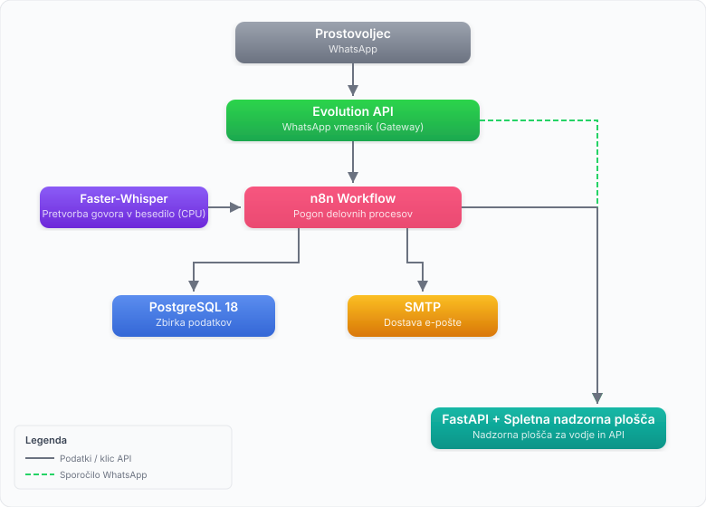

[English](SPEC.md)

# BelPro — Specifikacija sistema
*Beleženje Prostovoljstva* — Digitalni dnevnik prostovoljskega dela za slovenske nevladne organizacije

---

## 1. Pregled projekta

BelPro je na vašem sistemu delujoč, z umetno inteligenco podprt sistem, ki avtomatizira vodenje *Dnevnika prostovoljskega dela*, ki ga slovenska zakonodaja zahteva za prejemnike *Dodatka za delovno aktivnost*.

Vsaka NVO poganja lastno, neodvisno instanco BelPro. Prostovoljci komunicirajo izključno prek WhatsAppa. Vodja NVO uporablja spletno nadzorno ploščo. Brez Internet strežnika, brez stroškov za storitve v oblaku.

### Pravni okvir
- Ureja ga *Zakon o prostovoljstvu* in ZVOP-2/GDPR.
- Vsak prostovoljec mora imeti podpisan *Dogovor o prostovoljstvu* z NVO.
- Mesečno dokazilo o aktivnosti (*potrdilo*) je treba predložiti lokalnemu CSD do konca meseca oziroma najpozneje do 8. dne naslednjega meseca.
- Če ima prostovoljec podpisan dogovor, velja za »delovno aktivnega« za 60–128 ur/mesec, ne glede na točno zabeležene ure. Dnevnik je revizijska sled, ne strog števec ur.

---

## 2. Pregled arhitekture



### Komponente

| Komponenta | Tehnologija | Vloga |
|-----------|-----------|------|
| Sporočilni vmesnik | WhatsApp prek Evolution API | Komunikacija s prostovoljci |
| Procesni pogon | n8n (samogostovan) | Orkestracija vse poslovne logike |
| Prepisovanje | Faster-Whisper (CPU, lokalno) | Glasovna sporočila → besedilo |
| Zbirka podatkov | PostgreSQL (samogostovana) | Vsi trajni podatki |
| Nadzorna plošča | FastAPI + HTML/JS/CSS (nginx) | Spletni vmesnik za vodje |
| E-pošta | Splošni SMTP (n8n vozlišče Send Email) | Mesečni PDF-ji, obvestila |
| Ustvarjanje PDF | Python (WeasyPrint) | Mesečna zbirna dokumenta |
| Vsebnikovanje | Docker Compose | Vse storitve |

**Načrtovalsko načelo:** Kjer je mogoče, se uporabljajo obstoječa n8n vozlišča in standardne storitve. Lastna koda samo tam, kjer vozlišče ne obstaja.

---

## 3. Podatkovni model

### `volunteers`
| Polje | Tip | Opomba |
|-------|------|-------|
| id | UUID PK | |
| first_name | VARCHAR | Uporablja se v neformalnih WhatsApp sporočilih |
| last_name | VARCHAR | Uporablja se v formalnih dokumentih in PDF-jih |
| street | VARCHAR | Ime ulice in hišna številka |
| postal_code | VARCHAR(4) | Slovenska 4-mestna poštna številka |
| city | VARCHAR | |
| emso | TEXT | EMŠO — šifriran z AES-256-GCM (base64-kodirana šifrirana vrednost) |
| emso_hash | VARCHAR(64) | HMAC-SHA256 čistopisnega EMŠO — deterministično, za zagotavljanje edinstvenosti; nullable |
| phone | VARCHAR | WhatsApp številka (mednarodna oblika, edinstvena) |
| email | VARCHAR | Za dostavo mesečnih PDF-jev |
| registered_at | TIMESTAMP | |
| active | BOOLEAN | Mehki izbris / deaktivacija |
| report_whatsapp | BOOLEAN | Pošlji mesečni PDF prostovoljcu prek WhatsAppa; privzeto FALSE |
| report_email | BOOLEAN | Pošlji mesečni PDF prostovoljcu prek e-pošte; privzeto TRUE |
| manager_id | FK → managers | |

### `managers`
| Polje | Tip | Opomba |
|-------|------|-------|
| id | UUID PK | |
| first_name | VARCHAR | |
| last_name | VARCHAR | |
| phone | VARCHAR | WhatsApp številka (edinstvena) |
| email | VARCHAR | (edinstvena) |
| ngo_name | VARCHAR | Ime NVO |
| ngo_street | VARCHAR | Ime ulice in hišna številka |
| ngo_postal_code | VARCHAR(4) | Slovenska 4-mestna poštna številka |
| ngo_city | VARCHAR | |
| ngo_davcna | VARCHAR(8) | Davčna številka; nullable |
| password_hash | TEXT | Zgoščena vrednost gesla (scrypt); nullable do prve nastavitve prek vmesnika |
| report_whatsapp | BOOLEAN | Vodja prejme zbirno poročilo prek WhatsAppa; privzeto FALSE |
| report_email | BOOLEAN | Vodja prejme zbirno poročilo prek e-pošte; privzeto TRUE |
| default_report_whatsapp | BOOLEAN | Privzeta vrednost zastavice WhatsApp za novo registrirane prostovoljce; privzeto FALSE |
| default_report_email | BOOLEAN | Privzeta vrednost zastavice e-pošte za novo registrirane prostovoljce; privzeto TRUE |
| ngo_whatsapp_phone | VARCHAR(30) | Namenska telefonska številka bota, povezana z Evolution API; samo cifre, brez predpone `+` (nullable). Ob prvem zagonu se nastavi iz `NGO_WHATSAPP_PHONE` v `.env`; samodejno se sinhronizira z Evolution API ob vzpostavljeni povezavi. |
| smtp_host | VARCHAR | Ime SMTP strežnika, npr. smtp.gmail.com (nullable, nastavi se prek vmesnika) |
| smtp_port | INTEGER | SMTP vrata, privzeto 587 (nullable, nastavi se prek vmesnika) |
| smtp_user | VARCHAR | SMTP prijava / naslov pošiljatelja (nullable, nastavi se prek vmesnika) |
| smtp_from_name | VARCHAR | Prikazno ime za odhodno e-pošto (nullable, nastavi se prek vmesnika) |
| evolution_api_admin_url | VARCHAR | URL skrbniškega vmesnika Evolution API za povezavo v nastavitvah (nullable) |
| created_at | TIMESTAMP | |

### `log_entries`
| Polje | Tip | Opomba |
|-------|------|-------|
| id | UUID PK | |
| volunteer_id | FK → volunteers | |
| work_date | DATE | Datum dela, ne oddaje |
| activity_description | TEXT | Očiščeno/normalizirano besedilo |
| raw_transcript | TEXT | Izvirni izpis Whisperja |
| hours | NUMERIC(4,1) | Izluščeno iz prepisa |
| location | VARCHAR | Izluščeno ali sklepano |
| status | ENUM | `pending_volunteer`, `pending_manager`, `approved`, `rejected` |
| volunteer_confirmed_at | TIMESTAMP | |
| manager_approved_at | TIMESTAMP | |
| manager_notified_at | TIMESTAMP | Kdaj je bil vodja nazadnje obveščen; hkrati samo en aktiven vnos |
| created_at | TIMESTAMP | |
| updated_at | TIMESTAMP | Vzdržuje DB sprožilec `trg_entries_updated_at` |

Fotografije so shranjene v ločeni tabeli `log_entry_photos` (glej spodaj) — podprtih je več fotografij na vnos.

### `log_entry_photos`
| Polje | Tip | Opomba |
|-------|------|-------|
| id | UUID PK | |
| log_entry_id | FK → log_entries | CASCADE DELETE |
| photo_path | VARCHAR(500) | Relativna pot do shranjene fotografije |
| photo_exif_timestamp | TIMESTAMP | Izluščeno iz EXIF podatkov fotografije (nullable) |
| photo_exif_lat | NUMERIC(10,7) | GPS širina iz EXIF (nullable) |
| photo_exif_lon | NUMERIC(10,7) | GPS dolžina iz EXIF (nullable) |
| uploaded_at | TIMESTAMP | |

### `monthly_reports`
| Polje | Tip | Opomba |
|-------|------|-------|
| id | UUID PK | |
| volunteer_id | FK | nullable (NULL = zbirno poročilo za vodjo) |
| period_year | INT | |
| period_month | INT | |
| pdf_path | VARCHAR | |
| generated_at | TIMESTAMP | |
| sent_at | TIMESTAMP | nullable |

### `settings`
| Polje | Tip | Opomba |
|-------|------|-------|
| id | UUID PK | |
| name | TEXT | Ključ nastavitve (edinstven, ne sme biti null) |
| type | TEXT | Namig tipa vrednosti: `'int'`, `'bool'`, `'text'`, `'json'` |
| value | TEXT | Shranjena vrednost (nullable — pri odsotnosti se uporabi privzeta vrednost iz `.env`) |

Ob prvi migraciji se vnese s tremi vrsticami: `max_photos_per_entry` (privzeto `5`), `photo_retention_days` (privzeto `730`), `session_duration_hours` (privzeto `24`). Vse vrednosti, nastavljive med delovanjem, so shranjene tukaj in ne hardcoded ali brane izključno iz `.env`. Glejte storitev `AppSettings` in `GET/PATCH /api/admin/settings`.

---

## 4. WhatsApp tok (prostovoljec)

### 4.1 Oddaja vnosa

```
Prostovoljec pošlje:
  - Glasovno sporočilo (obvezno)    → Faster-Whisper prepiše
  - Fotografijo (izbirno)           → EXIF izluščen, shranjen
  - Besedilno sporočilo (alternativa) → Uporabi se neposredno

n8n izlušči iz prepisa:
  - activity_description
  - hours (išče "uro", "uri", "ure", "ur" itd.)
  - work_date (išče "danes", "včeraj", imena dni, izrecne datume)
  - location (če je omenjena)

n8n pošlje prostovoljcu potrditveno sporočilo:
  ┌─────────────────────────────────────────┐
  │ Potrdite vnos:                          │
  │                                         │
  │ 📅 Datum: 12. 5. 2025                   │
  │ 🕐 Ure: 3                               │
  │ 📍 Kraj: Dom starejših Trnovo           │
  │ 📝 Aktivnost: Pomoč pri kosilu          │
  │                                         │
  │ [✅ Potrdi] [✏️ Popravi] [❌ Prekliči] │
  └─────────────────────────────────────────┘

Če prostovoljec potrdi → vnos se premakne v `pending_manager`
Če prostovoljec izbere Popravi → bot ga prosi, naj vnos pošlje znova kot besedilo.
  Prostovoljec lahko popravi poljubno večkrat. Ni omejitve.
Če prostovoljec izbere Prekliči → vnos se zavrže, prostovoljec je obveščen.

Vodja prejme WhatsApp obvestilo:
  ┌─────────────────────────────────────────┐
  │ Nov vnos čaka na odobritev:             │
  │                                         │
  │ 👤 Ime Priimek                          │
  │ 📅 12. 5. 2025 — 3 ure                 │
  │ 📝 Pomoč pri kosilu, Dom starejših      │
  │                                         │
  │ [✅ Odobri]  [❌ Zavrni]               │
  └─────────────────────────────────────────┘

Vodja odobri → status vnosa `approved`, prostovoljec obveščen
Vodja zavrne → status vnosa `rejected`, prostovoljec obveščen z
              opombo, da ga bo vodja kontaktiral prek WhatsAppa
```

### 4.2 Manjkajoča fotografija
- Fotografija je izbirna, ni obvezna.
- Če je fotografija prisotna, se izluščijo in shranijo EXIF podatki (časovni žig, GPS).
- Vodja vidi oznako fotografije v obvestilu za odobritev.
- Vodja odloči, ali odobri vnos brez fotografije.
- Ni samodejnega ponovnega pozivanja za manjkajoče fotografije.
- **Odstranjevanje EXIF v WhatsAppu:** WhatsApp pred dostavo slike znova kodira in pri tem odstrani vse EXIF metapodatke. Fotografijam, poslane prek WhatsAppa, v zbirki podatkov ne bodo na voljo GPS ali časovni žig. EXIF se ohrani le pri fotografijah, neposredno naloženih prek nadzorne plošče za vodje. Koda za izluščevanje in prikaz je vzpostavljena in se samodejno aktivira, kadar so podatki prisotni.

### 4.3 Vidnost poslanih sporočil na povezanem telefonu

Vsa sporočila, ki jih bot pošlje prek Evolution API, so poslana *z* WhatsApp številke instance in so zato vidna v zgodovini pogovorov te številke na vsakem povezanem telefonu. To je vedenje WhatsApp protokola — neizogibno pri uporabi s-telefonom-povezanega API-ja. Instanca mora uporabljati namensko telefonsko številko, ne osebne številke vodje.

### 4.4 Jezik prostovoljcev
- Izključno slovenščina (vsa sporočila bota v slovenščini).
- Whisper je nastavljen z jezikovnim namigom `sl` (slovenščina) in samodejnim zaznavanjem kot rezervo.
- Razčlenjevanje prepisa (datum, ure, lokacija, aktivnost) izvaja ujemanje vzorcev v n8n kodni vozlišči. Korak normalizacije z LLM ni implementiran.

---

## 5. Nadzorna plošča za vodje (spletni vmesnik)

Strežnik nginx, zaledni sistem FastAPI. Odzivna zasnova, prijazna za mobilne naprave. Dostopna z mobilnega telefona ali namiznega brskalnika.

### Strani / Pogledi

#### 5.1 Prostovoljci
- Seznam vseh prostovoljcev (ime, priimek, telefon, e-pošta, status aktivnosti, skupne ure v tem mesecu)
- Filtri: aktivni / neaktivni / vsi, razpon datumov registracije, kraj
- Razvrščanje: po katerem koli stolpcu (ime, ure, datum registracije)
- Obrazec za dodajanje novega prostovoljca (ime, priimek, ulica, poštna številka, kraj, EMŠO, telefon, e-pošta, potrditvena polja za kanal poročil)
- Preklopniki za kanal poročil posameznega prostovoljca: WhatsApp in/ali e-pošta (urejanje neposredno v seznamu; privzete vrednosti izhajajo iz globalnih privzetih vrednosti vodje)
- Vrstično urejanje kontaktnih podatkov posameznega prostovoljca: ime + priimek (ena cona urejanja), telefon, e-pošta — vsak s svojim preklopnikom svinčnika in gumboma Shrani/Prekliči; EMŠO in datum registracije sta samo za branje
- Deaktivacija prostovoljca (mehak izbris)
- Pregled zgodovine posameznega prostovoljca

#### 5.2 Čakajoče odobritve
- Seznam vseh vnosov s statusom `pending_manager`
- Vsak vnos prikazuje: ime prostovoljca, datum, ure, aktivnost, lokacijo, sličico fotografije (če je prisotna)
- Gumba Odobri / Zavrni (sproži n8n spletno kljuko → WhatsApp obvestilo prostovoljcu)

#### 5.3 Dnevnik / Zgodovina
- Celoten seznam vseh vnosov z možnostjo iskanja (filtriranje po prostovoljcu, mesecu, statusu, imenu lokacije)
- Filter lokacije je iskanje po prostem besedilu v polju `location` — uporabno za prikaz vseh ur, zabeleženih na določeni lokaciji, v katerem koli časovnem obdobju
- Filter datumskega razpona neodvisen od koledarskega meseca
- Izvoz filtriranih rezultatov v CSV

#### 5.4 Analitika
Strežena z `GET /api/analytics/summary` (dostop: vodja). Izbirna parametra `year`/`month`; privzeto tekoči mesec. Vsi seštevki in vsote ur so omejeni na izbrani mesec.

- Ploščice KPI: skupne odobrene ure, število aktivnih prostovoljcev, čakajoči / odobreni / zavrnjeni vnosi, prostovoljci brez vnosov v tistem mesecu
- Ure po prostovoljcu — vodoravni palični grafikon; prikazani so samo prostovoljci z vsaj enim vnosom (katerega koli statusa) v izbranem mesecu
- Ure po lokaciji — navpični palični grafikon (samo odobreni vnosi, vpisana lokacija)
- Mesečni trend — črtni grafikon za 6 koledarskih mesecev do izbranega meseca
- Izbirnik leta/meseca za navigacijo v katerokoli preteklo obdobje
- Tiskalniku prijazna postavitev (`@media print` skriva navigacijo, filtre in gumb za izvoz)
- Izvoz podatkov v CSV (s predpono BOM za pravilno prikazovanje UTF-8 v Excelu)

Grafikoni so upodobljeni na strani odjemalca z **Chart.js v4** (CDN, brez koraka gradnje).

#### 5.5 Poročila
- Ustvarjanje mesečnih PDF poročil na zahtevo (po prostovoljcu ali zbirno)
- Pregled predhodno ustvarjenih PDF-jev
- Ročno sprožanje pošiljanja po e-pošti, kadar je to potrebno
- **Arhiv poročil** — zložljivi razdelek s seznamom vseh predhodno ustvarjenih PDF-jev za vsa obdobja z možnostjo prenosa; preklopnik je vgrajen na isti strani

#### 5.6 Nastavitve
- Profil vodje (ime, priimek, telefon, e-pošta, ime NVO, naslov NVO)
- Sprememba gesla
- Kanal poročil za vodjo: potrditvena polja, ki določajo, ali vodja prejme zbirno mesečno poročilo prek WhatsAppa in/ali e-pošte
- Globalne privzete vrednosti za kanal poročil prostovoljcev: potrditvena polja, ki nastavijo začetni vrednosti `report_whatsapp` / `report_email` za novo registrirane prostovoljce
- Nastavitev SMTP (gostitelj, vrata, prijava in prikazno ime so urejljivi v vmesniku; geslo ostane v `.env` kot `SMTP_PASSWORD`; deluje z Gmail, Yahoo, Proton ali katerim koli SMTP strežnikom)
- Telefonska številka WhatsApp bota — samo za branje, kadar je Evolution API povezan (številka in stanje se ob vsakem nalaganju strani z nastavitvami sinhronizirata v živo z Evolution API; ob spremembi se samodejno zapišeta v zbirko podatkov in `.env`). Spreminjane možno le pri prekinitvi povezave.
- Predloga dogovora o prostovoljstvu (besedilo, uporabljeno v glavi PDF) *(načrtovano)*

#### 5.7 Administracija (sistemske nastavitve)
Vrednosti, nastavljive med delovanjem sistema. Spremembe stopijo v veljavo takoj, brez ponovnega zagona vsebnika.

- **Največje število fotografij na vnos** (`max_photos_per_entry`) — največje število fotografij, ki jih prostovoljec lahko priloži posamičnemu vnosu; uveljavljeno na ravni API ob nalaganju
- **Hranjenje fotografij (dni)** (`photo_retention_days`) — čas hrambe shranjenih fotografij; uporablja ga načrtovano opravilo za čiščenje
- **Trajanje seje (ure)** (`session_duration_hours`) — trajanje piškotka seje vodje

Vrednosti so shranjene v tabeli `settings` prek storitve `AppSettings` in dostopne prek `GET/PATCH /api/admin/settings`. Storitev ob odsotnosti vrstice v zbirki podatkov privzame vrednosti iz `.env`, tako da sistem pravilno deluje pred izrecno nastavitvijo katere koli vrednosti.

---

## 6. Mesečna PDF poročila

### 6.1 PDF za prostovoljca (po osebi)
Ustvari se za vsakega prostovoljca. Namenjeno tiskanju in oddaji na CSD.

Vsebina:
- Ime, naslov in logotip NVO (prostor za logotip)
- Ime prostovoljca, naslov, EMŠO (zadnje 3 cifre so v prikazni kopiji prikriti)
- Mesec in leto
- Tabela: Datum | Aktivnost | Ure | Lokacija | Status
- Skupne ure
- Noga: vrstica za podpis vodje, prostor za žig, datum

Oblika: A4, čist/minimalen, v slovenščini. Čim bližje strukturi CSD *potrdila*, da lahko prostovljec le podpiše.

### 6.2 Zbirni PDF za vodjo
En dokument za vodjo s podatki vseh prostovoljcev za mesec.

Vsebina:
- Zbirna tabela: Prostovoljec | Skupne ure | Vnosi | Status
- Razdelek za vsakega prostovoljca z njegovimi podrobnostmi vnosov
- Časovni žig ustvarjanja

### 6.3 Dostava
- **Samodejno:** Cron opravilo se sproži 28. v mesecu. Ustvari vse PDF-je. Pošlje PDF prostovoljca na e-poštni naslov prostovoljca (s privolitvijo). Pošlje zbirni PDF na e-poštni naslov vodje.
- **Ročno:** Vodja lahko kadar koli sproži ustvarjanje in prenos/pošiljanje z nadzorne plošče.
- **Tisk:** PDF-ji so na voljo za prenos/tisk v pisarni NVO.

---

## 7. E-pošta

- Za vso odhodno e-pošto se uporablja n8n vozlišče Send Email (SMTP).
- Deluje s **katerim koli** ponudnikom SMTP. Sistem je neodvisen od ponudnika — nastavitev je v vmesniku Nastavitve. Primeri:
  - **Gmail:** smtp.gmail.com:587 z [geslom za aplikacijo](https://myaccount.google.com/apppasswords)
  - **Yahoo Mail:** smtp.mail.yahoo.com:587
  - **Proton Mail:** Proton Mail Bridge (lokalni SMTP)
  - **Institucijski / samogostovan:** kateri koli standarden SMTP strežnik
- Gostitelj SMTP, vrata, prijava in prikazno ime se nastavijo prek vmesnika Nastavitve in shranijo v tabeli `managers`. Geslo ostane v `.env` kot `SMTP_PASSWORD`.
- Poslana e-pošta: dostava mesečnih PDF-jev, obvestila o odobritvi/zavrnitvi vnosov (izbirna rezerva, kadar WhatsApp ne deluje).

---

## 8. GDPR in zasebnost

- EMŠO se shranjuje šifriran (šifriranje na ravni aplikacije z AES-256).
- Fotografije so shranjene lokalno na strežniku, ne v oblačni hrambi.
- EXIF podatki fotografij (časovni žig, GPS) se hranijo kot revizijska sled.
- Obrazi ne smejo biti na fotografijah (uveljavljeno s politiko v dogovoru o prostovoljstvu, ne tehnično).
- Podatki se hranijo toliko časa, kolikor zahtevajo inšpekcijski roki CSD/IRSD.
- Nobeno deljenje podatkov s tretjimi stranmi, razen uradne revizije.
- Prostovoljčevo soglasje za e-poštno dostavo mesečnega PDF je zajeto v dogovoru o prostovoljstvu.

---

## 9. Struktura projekta

```
belpro/
├── docker-compose.yml
├── .env.example
├── README.md
├── SPEC.md
├── CLAUDE.md
│
├── n8n/
│   ├── workflows/
│   │   ├── volunteer_entry.json       # Glavni tok WhatsApp → vnos
│   │   ├── manager_approval.json      # Tok odobritve
│   │   └── monthly_reports.json       # Cron → PDF → e-pošta
│   └── credentials/                   # Gitignorirano, priložen primer

> **Kanonični vir delovnih procesov:** `n8n/workflows/` je vir resnice za vse definicije delovnih procesov.
> Pri sveži namestitvi jih naložite v n8n z `./scripts/n8n_workflows.py import`.
> Po urejanju delovnega procesa v n8n vmesniku ga izvozite z `./scripts/n8n_workflows.py export` in rezultat objavite v repozitorij.
│
├── whisper/
│   ├── Dockerfile
│   └── transcribe.py                  # Tanek HTTP ovojnik za Faster-Whisper
│
├── api/
│   ├── Dockerfile
│   ├── requirements.txt
│   ├── main.py                        # Vstopna točka FastAPI aplikacije
│   ├── core/
│   │   ├── auth.py                    # Odvisnost HTTP Basic Auth
│   │   └── settings.py                # Pydantic BaseSettings (okoljske spremenljivke)
│   ├── routers/
│   │   ├── volunteers.py
│   │   ├── log_entries.py             # Vnosi + nalaganje fotografij/EXIF
│   │   ├── managers.py                # Profil vodje + nastavitev gesla
│   │   ├── reports.py
│   │   ├── analytics.py               # Zbirna analitična končna točka
│   │   └── admin.py                   # GET/PATCH /api/admin/settings
│   ├── models/                        # SQLAlchemy ORM modeli
│   │   └── app_setting.py             # ORM model AppSetting (tabela settings)
│   ├── schemas/                       # Pydantic sheme zahtev/odgovorov
│   ├── services/
│   │   ├── report_pdf.py              # Ustvarjanje PDF z WeasyPrint
│   │   ├── encryption.py              # AES-256-GCM šifriranje/dešifriranje/zgoščevanje EMŠO
│   │   ├── password.py                # Zgoščevanje gesel z bcrypt
│   │   └── app_settings.py            # AppSettings: konfiguracija s prednostjo zbirke podatkov in rezervo na .env
│   └── db/
│       └── migrations/                # Alembic migracije (podmapy versions/; trenutna glava: 006_whatsapp_and_smtp_config)
│
├── frontend/
│   ├── index.html                     # Enostranska aplikacija (usmerjanje na strani odjemalca)
│   ├── css/
│   │   └── main.css
│   └── js/
│       ├── api.js                     # Centraliziran ovojnik fetch / osnovni URL API
│       ├── volunteers.js              # Pogledi prostovoljcev, odobritev, dnevnika, nastavitev; usmerjevalnik
│       ├── reports.js                 # Pogled poročil (vključuje razdelek Arhiv poročil)
│       ├── analytics.js              # Stran analitike (grafikoni prek Chart.js v4 CDN)
│       └── admin.js                   # Stran Administracija (sistemske nastavitve)
│
├── nginx/
│   └── nginx.conf
│
├── scripts/
│   ├── setup.sh                       # Čarovnik za začetno namestitev
│   ├── backup.sh                      # Varnostno kopiranje zbirke podatkov in fotografij
│   ├── restore.sh
│   ├── list_pending_entries.py        # Izpis čakajočih vnosov kot JSON za ročni sprožilec n8n
│   └── switch_manager_phone.ps1      # Preklapljanje telefonske številke vodje med pravo/testno za testiranje
│
└── db/
    └── init.sql                       # Začetna shema
```

---

## 10. Namestitev

- En sam sklad Docker Compose.
- Cilj: kateri koli Linux gostitelj (lokalni razvojni stroj, VPS, strežnik na lokaciji).
- **Lokalni razvoj:** Windows 10 z WSL2 + Docker Desktop. Vsi ukazi `docker compose` in lupinske skripte se izvajajo znotraj WSL2 (Ubuntu). Ne predpostavljajte izvornih Windows poti ali orodij.
- Storitve: `postgres`, `n8n`, `whisper`, `api`, `frontend` (nginx), `evolution-api`.
- Vsa konfiguracija prek datoteke `.env`.
- `setup.sh` vodi začetno konfiguracijo (poverilnice vodje, Gmail, vezava WhatsApp številke).
- Brez Kubernetesa, brez odvisnosti od oblačnih ponudnikov.

---

## 11. Zunaj obsega — različica v1

- Večnajemniški / SaaS način
- Več vodij znotraj ene NVO
- Podpora za jezike, ki niso slovenščina
- Domača mobilna aplikacija
- Integracija z IRSD / vladnimi sistemi
- Samodejno zaznavanje obrazov na fotografijah
- Samoregistracija prostovoljcev prek WhatsAppa

---

## 12. Pripomočki za testiranje

Dve skripti v `scripts/` zmanjšata potrebno število telefonov za celovito testiranje s treh na dva (ali enega, s telefonom z dvema SIM karticama).

**Brez teh skript** so za testiranje celotnega toka potrebne tri WhatsApp številke:
1. Namenski telefon s programom Evolution API (bot) — vedno ločen
2. Telefon prostovoljca za pošiljanje sporočil
3. Telefon vodje za prejemanje obvestil o odobritvi

**S temi skriptami** si vlogi prostovoljca in vodje delita en telefon (in SIM kartico), s čimer se zahteva zmanjša na dva telefona skupaj. Če vaš telefon podpira dva SIM, zadostuje en telefon — druga SIM poganja bota, prva SIM pa opravlja obe vlogi: prostovoljca in vodje.

### `load_env.ps1` / `load_env.sh`
Naloži vse spremenljivke iz `.env` v trenutno lupinsko sejo. Zaženite enkrat pred uporabo ostalih skript.

PowerShell (Windows):
```
. .\scripts\load_env.ps1
```
Bash (Linux / WSL2):
```bash
source scripts/load_env.sh
```

### `switch_manager_phone.ps1` / `switch_manager_phone.sh`
Preklopi telefonsko številko vodje v zbirki podatkov med pravo in navidezno številko.

PowerShell (Windows):
```
.\scripts\switch_manager_phone.ps1 volunteer   # nastavi telefon vodje na navidezno → vaš telefon deluje kot prostovoljec
.\scripts\switch_manager_phone.ps1 manager     # nastavi telefon vodje na pravo → vaš telefon deluje kot vodja
```
Bash (Linux / WSL2):
```bash
bash scripts/switch_manager_phone.sh volunteer
bash scripts/switch_manager_phone.sh manager
```

Uporablja okoljske spremenljivke `TEST_MANAGER_PHONE` (vaša prava številka) in `TEST_VOLUNTEER_PHONE` (navidezni ohranitveni vnos) ter `MANAGER_PASSWORD` za overitev API-ja. Glejte `.env.example` za konfiguracijo.

Ko je telefon vodje nastavljen na navidezno številko, obvestilo za odobritev ne gre nikamor in tok prostovoljca lahko testirate ločeno. Ko preklopite nazaj, vaš telefon spet prejema obvestila za vodjo.

### `list_pending_entries.py`
Izpiše vse vnose s statusom `pending_manager` kot objekte JSON, pripravljene za lepljenje v vozlišče ročnega sprožilca n8n.

```
python scripts/list_pending_entries.py          # vnosi, ki še niso bili obveščeni
python scripts/list_pending_entries.py --all    # vključi že obveščene vnose
```

Zahteva `MANAGER_PASSWORD` v okolju. Bere iz FastAPI zalednega sistema na naslovu `BELPRO_API_URL` (privzeto `http://localhost:8100/api`).

### Tipičen potek testiranja

PowerShell (Windows):
```
# 0. Nalaganje okoljskih spremenljivk (enkrat na sejo):
. .\scripts\load_env.ps1
# 1. Prostovoljec pošlje glasovno sporočilo prek WhatsAppa → n8n ga obdela
# 2. Prostovoljec potrdi (Potrdi) → vnos se premakne v pending_manager
# 3. Izpis čakajočega vnosa:
python scripts/list_pending_entries.py
# 4. Kopirajte izpis JSON v vozlišče ročnega sprožilca n8n
# 5. Izvedite ročni sprožilec n8n → pošlje sporočilo za odobritev vodji
# 6. Preklopite telefon v način vodje za prejemanje obvestila:
.\scripts\switch_manager_phone.ps1 manager
# 7. Odgovorite Odobri v WhatsAppu → tok se zaključi
# 8. Preklopite nazaj za naslednji test prostovoljca:
.\scripts\switch_manager_phone.ps1 volunteer
```
Bash (Linux / WSL2):
```bash
# 0. Nalaganje okoljskih spremenljivk (enkrat na sejo):
source scripts/load_env.sh
# 1–5. enako kot zgoraj
# 6. Preklopite telefon v način vodje:
bash scripts/switch_manager_phone.sh manager
# 7. Odgovorite Odobri v WhatsAppu → tok se zaključi
# 8. Preklopite nazaj:
bash scripts/switch_manager_phone.sh volunteer
```

### Vozlišča ročnega sprožilca v n8n

Potek testiranja se opira na dve vozlišči ročnega sprožilca v n8n delovnih procesih:

| Delovni proces | Ime vozlišča | Kaj naredi |
|----------|-----------|--------------|
| **BelPro — Vnos Prostovoljcev** | `Manual: Poslji Obvestilo Upravljalcu` | Pošlje obvestilo vodji za odobritev čakajočih vnosov |
| **BelPro — Odobritev Upravljalca** | `Manual Trigger` | Sproži tok odobritve vodje (simulira odgovor vodje na obvestilo) |

---

## 13. Avtomatizirana testna zbirka

Varnostna mreža za regresijsko testiranje zalednega sistema FastAPI, ki temelji na pytest. Obseg: vse API končne točke, srečna pot in ključni primeri napak. Testi delovnih procesov n8n so izvzeti (čakajo strukturne spremembe).

### Infrastruktura

- **Testna zbirka podatkov:** `belpro_test` — druga zbirka podatkov na obstoječem Docker vsebniku `postgres`, dosegljiva na `localhost:5432` iz WSL2. Produkcijski `DATABASE_URL` se nikoli ne dotakne.
- **Konfiguracija:** `api/.env.test` (gitignorirano) usmeri pytest na `belpro_test` in posreduje testne skrivnosti.
- **Izolacija:** Vsak test se izvede znotraj SQLAlchemy SAVEPOINT. Vse spremembe se ob zaključku povrnejo — med testi ni uhajanja podatkov.
- **Brez navideznih objektov.** Vsi testi delajo z resnično PostgreSQL zbirko podatkov.

### Zagon

```bash
# Iz mape api/ na WSL2 gostitelju (ne znotraj vsebnika):
cd api
python -m pytest tests/ -v
```

Zahteva, da Docker vsebnik `postgres` teče in da `belpro_test` obstaja (samodejno ustvarjena ob prvem zagonu z vpičiščem motorja v obsegu seje).

### Testne datoteke

| Datoteka | Pokritost |
|------|----------|
| `tests/test_health.py` | `GET /api/health` |
| `tests/test_managers.py` | Profil vodje, omejitev enega vodje, overitev |
| `tests/test_volunteers.py` | Celoten CRUD prostovoljcev, deaktivacija/aktivacija, zaznavanje podvojenih EMŠO |
| `tests/test_log_entries.py` | Celoten CRUD dnevniških zapisov, stroj stanj (odobri/zavrni/potrdi), preverjanje fotografij |
| `tests/test_reports.py` | Ustvarjanje poročil, vrsta vsebine PDF, 404 za neznanega prostovoljca |
| `tests/test_analytics.py` | Oblika povzetka, štetje ur samo za odobrene, 6-točkovni mesečni trend |
| `tests/test_app_settings.py` | Vnos podatkov v tabelo `settings`, enotni testi storitve `AppSettings`, `GET/PATCH /api/admin/settings`, uveljavljanje na ravni poti (omejitev fotografij, piškotek seje) |

### Dimni test varnostnega kopiranja in obnovitve

`scripts/test_backup_restore.sh` — zažene se ročno, ni del privzete zbirke pytest. Vpiše znane podatke, zažene `backup.sh`, izbriše zbirko podatkov `belpro`, obnovi prek `restore.sh` in preveri prisotnost vpisanih zapisov.

---

## 14. Integracijski testi delovnih procesov

Ločena zbirka pytest, ki celovito preizkusi delovni proces `volunteer_entry` n8n. Za razliko od testov API (ki za testno zbirko podatkov uporabljajo ASGITransport znotraj procesa), ti testi delujejo na **celotnem živem Docker skladu** — pravem n8n, pravem Evolution API, pravi PostgreSQL — tako da na spletno kljuko n8n pošiljajo HTTP pakete v obliki WhatsApp sporočil in preverjajo stanje zbirke podatkov prek FastAPI.

### Predpogoji

- `docker compose up -d` (celoten sklad teče)
- Delovni proces `volunteer_entry` je v n8n **aktiven** (ne v testnem/poslušalnem načinu)
- `MANAGER_PASSWORD` je nastavljen v `.env`
- Prava WhatsApp številka, dosegljiva prek instance Evolution (testne telefonske številke v paketih bodo prejele prava sporočila)

### Zagon

```powershell
# Iz korenskega imenika projekta na Windows gostitelju:
python -m pytest tests/workflow/ -v
```

### Testne datoteke

| Datoteka | Namen |
|------|---------|
| `tests/workflow/conftest.py` | `api_client`/`n8n_client` v obsegu seje (httpx); vstopna točka `test_volunteer` v obsegu funkcije z neposrednim čiščenjem SQL |
| `tests/workflow/helpers.py` | Gradniki WhatsApp paketov (`make_text_payload`, `make_response_payload`), `post_to_webhook`, pripomočki za anketiranje |
| `tests/workflow/test_volunteer_entry.py` | 6 integracijskih scenarijev (glej spodaj) |
| `tests/workflow/test_photo_upload.py` | Neposredni testi API za nalaganje fotografij (mimo n8n) |

### Scenariji

| Test | Kaj pokriva |
|------|---------------|
| `test_happy_path_text_confirm` | Prostovoljec pošlje besedilni vnos → potrdi ("1") → vnos doseže `pending_manager` |
| `test_edit_path` | Prostovoljec pošlje besedilo → uredi ("2") → pošlje popravljeno besedilo → potrdi → izvirni vnos izbrisan, popravljeni vnos doseže `pending_manager` |
| `test_cancel_path` | Prostovoljec pošlje besedilo → prekliče ("4") → vnos izbrisan iz zbirke |
| `test_add_photos_then_confirm` | Prostovoljec izbere "Dodaj slike" ("3") → potrdi ("1") — vnos doseže `pending_manager` brez fotografije |
| `test_add_photos_then_cancel` | Prostovoljec izbere "Dodaj slike" ("3") → prekliče ("4") iz podmeni — vnos izbrisan |
| `test_unknown_volunteer_creates_no_entry` | Sporočilo z neregistrirane številke → ni ustvarjenega dnevniškega zapisa |

### Opombe o zasnovi

- **Brez navideznih objektov.** Evolution pošilja prava WhatsApp sporočila; zbirka podatkov je prava produkcijska. Uporabite namensko testno telefonsko številko.
- **Anketiranje, ne fiksno čakanje.** Vsak obrat anketira FastAPI do pojava pričakovanega stanja v zbirki, z odmorom 20 s. Med pogovornima obratoma se uporabi 2-sekundna pavza, da n8n ohrani stanje statičnih podatkov po ustvarjanju vrstice v zbirki (n8n zapiše stanje po vrnitvi klica HTTP).
- **Čiščenje prek neposrednega SQL.** `DELETE /api/volunteers/{id}` je blokiran, če obstajajo dnevniški zapisi; `DELETE /api/log-entries/{id}` sprejme samo vnose s statusom `pending_volunteer`. Vstopna točka čisti prek `docker compose exec postgres psql`, da zaobide omejitve API-ja.
- **Pot zvoka ni pokrita.** Testi prepisovanja Whisper zahtevajo pravo zvočno datoteko in znatno zakasnitev. Testirajte ločeno pri delu na storitvi prepisovanja.
