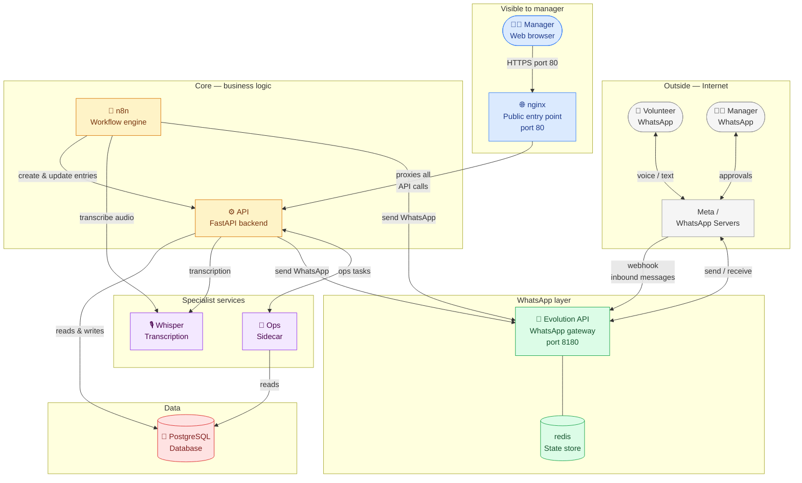

# BelPro — Component Diagram

Render with any Mermaid-compatible viewer (VS Code + Mermaid extension, GitHub, Obsidian, mermaid.live).

```mermaid
flowchart TB
    subgraph ext["Outside — Internet"]
        volunteer(["👤 Volunteer\nWhatsApp"])
        mgr_wa(["👩‍💼 Manager\nWhatsApp"])
        meta["Meta /\nWhatsApp Servers"]
    end

    subgraph visible["Visible to manager"]
        browser(["👩‍💼 Manager\nWeb browser"])
        nginx["🌐 nginx\nPublic entry point\nport 80"]
    end

    subgraph whatsapp["WhatsApp layer"]
        evolution["📱 Evolution API\nWhatsApp gateway\nport 8180"]
        redis[("redis\nState store")]
    end

    subgraph brain["Core — business logic"]
        api["⚙️ API\nFastAPI backend"]
        n8n["🔀 n8n\nWorkflow engine"]
    end

    subgraph specialist["Specialist services"]
        whisper["🎙️ Whisper\nTranscription"]
        ops["🔧 Ops\nSidecar"]
    end

    subgraph data["Data"]
        postgres[("🐘 PostgreSQL\nDatabase")]
    end

    %% External flows
    volunteer <-->|"voice / text"| meta
    mgr_wa <-->|"approvals"| meta
    meta -->|"webhook\ninbound messages"| evolution

    %% Manager dashboard
    browser -->|"HTTPS port 80"| nginx
    nginx -->|"proxies all\nAPI calls"| api

    %% WhatsApp internal
    evolution <-->|"send / receive"| meta
    evolution --- redis

    %% n8n orchestrates
    n8n -->|"create & update entries"| api
    n8n -->|"transcribe audio"| whisper
    n8n -->|"send WhatsApp"| evolution

    %% API coordinates
    api -->|"reads & writes"| postgres
    api -->|"transcription"| whisper
    api -->|"send WhatsApp"| evolution
    api <-->|"ops tasks"| ops
    ops -->|"reads"| postgres

    %% Styling
    classDef external fill:#f5f5f5,stroke:#999,color:#333
    classDef public fill:#dbeafe,stroke:#3b82f6,color:#1e3a8a
    classDef whatsapp fill:#dcfce7,stroke:#16a34a,color:#14532d
    classDef core fill:#fef3c7,stroke:#d97706,color:#78350f
    classDef specialist fill:#f3e8ff,stroke:#9333ea,color:#4a044e
    classDef db fill:#fee2e2,stroke:#dc2626,color:#7f1d1d

    class volunteer,mgr_wa,meta external
    class browser,nginx public
    class evolution,redis whatsapp
    class api,n8n core
    class whisper,ops specialist
    class postgres db
```
