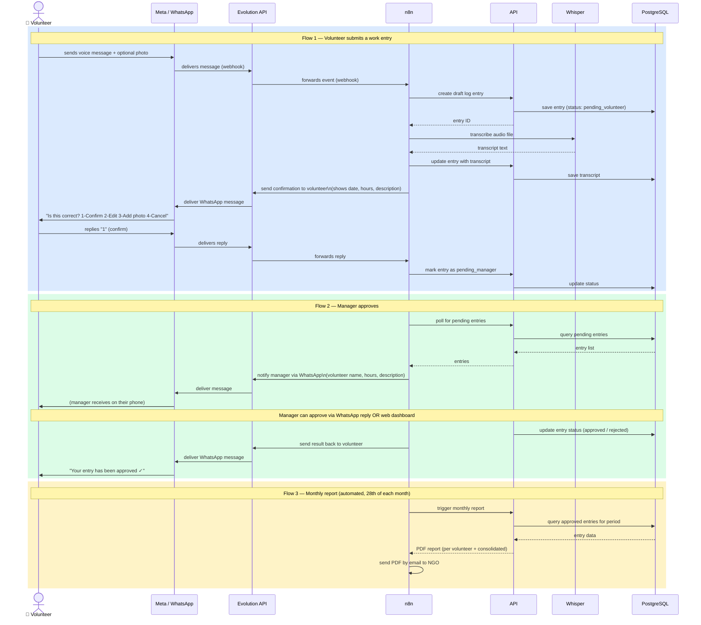

# BelPro — Sequence Diagram

Two flows: volunteer submitting a work entry, and manager approving it.
Render with any Mermaid-compatible viewer (VS Code + Mermaid extension, GitHub, Obsidian, mermaid.live).

