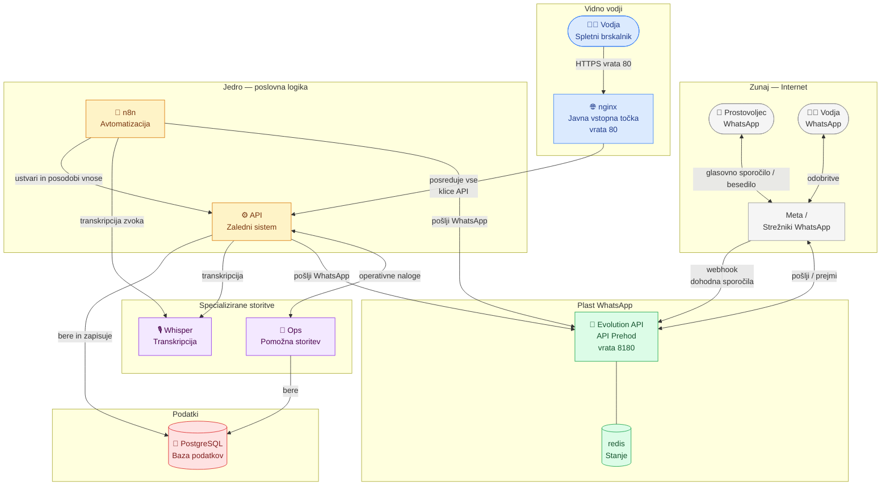

# BelPro — Diagram komponent

Odpri v katerem koli pregledovalniku Mermaid (VS Code + razširitev Mermaid, GitHub, Obsidian, mermaid.live).

```mermaid
flowchart TB
    subgraph ext["Zunaj — Internet"]
        volunteer(["👤 Prostovoljec\nWhatsApp"])
        mgr_wa(["👩‍💼 Vodja\nWhatsApp"])
        meta["Meta /\nStrežniki WhatsApp"]
    end

    subgraph visible["Vidno vodji"]
        browser(["👩‍💼 Vodja\nSpletni brskalnik"])
        nginx["🌐 nginx\nJavna vstopna točka\nvrata 80"]
    end

    subgraph whatsapp["Plast WhatsApp"]
        evolution["📱 Evolution API\nAPI Prehod\nvrata 8180"]
        redis[("redis\nStanje")]
    end

    subgraph brain["Jedro — poslovna logika"]
        api["⚙️ API\nZaledni sistem"]
        n8n["🔀 n8n\nAvtomatizacija"]
    end

    subgraph specialist["Specializirane storitve"]
        whisper["🎙️ Whisper\nTranskripcija"]
        ops["🔧 Ops\nPomožna storitev"]
    end

    subgraph data["Podatki"]
        postgres[("🐘 PostgreSQL\nBaza podatkov")]
    end

    %% Zunanji tokovi
    volunteer <-->|"glasovno sporočilo / besedilo"| meta
    mgr_wa <-->|"odobritve"| meta
    meta -->|"webhook\ndohodna sporočila"| evolution

    %% Nadzorna plošča
    browser -->|"HTTPS vrata 80"| nginx
    nginx -->|"posreduje vse\nklice API"| api

    %% WhatsApp interno
    evolution <-->|"pošlji / prejmi"| meta
    evolution --- redis

    %% n8n usmerja
    n8n -->|"ustvari in posodobi vnose"| api
    n8n -->|"transkripcija zvoka"| whisper
    n8n -->|"pošlji WhatsApp"| evolution

    %% API usklajuje
    api -->|"bere in zapisuje"| postgres
    api -->|"transkripcija"| whisper
    api -->|"pošlji WhatsApp"| evolution
    api <-->|"operativne naloge"| ops
    ops -->|"bere"| postgres

    %% Slogi
    classDef external fill:#f5f5f5,stroke:#999,color:#333
    classDef public fill:#dbeafe,stroke:#3b82f6,color:#1e3a8a
    classDef whatsapp fill:#dcfce7,stroke:#16a34a,color:#14532d
    classDef core fill:#fef3c7,stroke:#d97706,color:#78350f
    classDef specialist fill:#f3e8ff,stroke:#9333ea,color:#4a044e
    classDef db fill:#fee2e2,stroke:#dc2626,color:#7f1d1d

    class volunteer,mgr_wa,meta external
    class browser,nginx public
    class evolution,redis whatsapp
    class api,n8n core
    class whisper,ops specialist
    class postgres db
```
