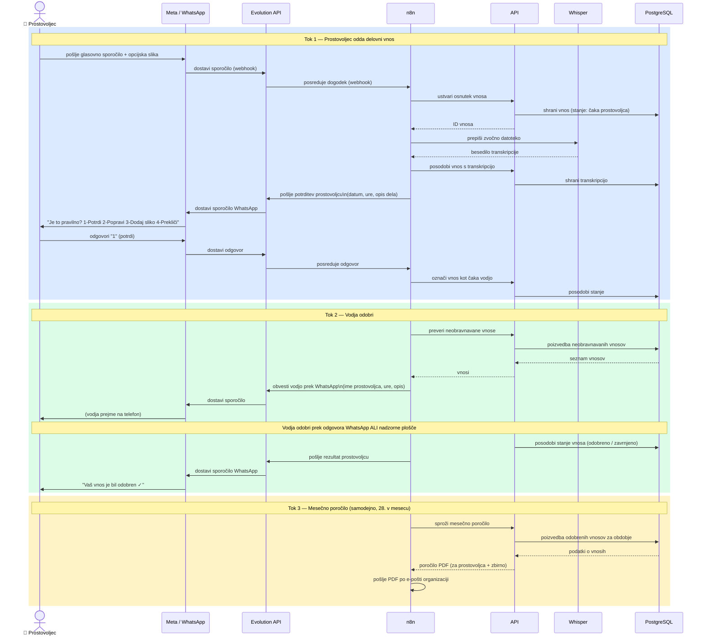

# BelPro — Diagram zaporedja

Trije tokovi: oddaja delovnega vnosa, odobritev vodje in mesečno poročanje.
Odpri v katerem koli pregledovalniku Mermaid (VS Code + razširitev Mermaid, GitHub, Obsidian, mermaid.live).

